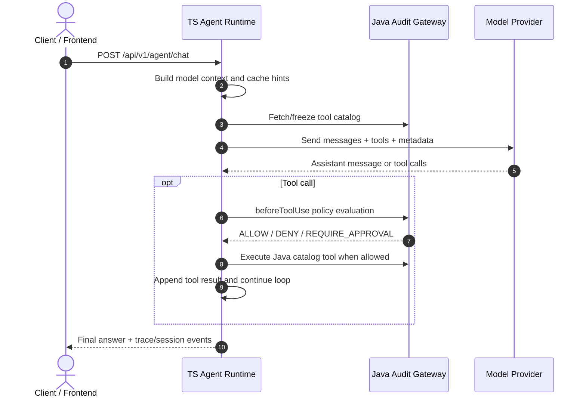

# OpenHarness

[](https://www.typescriptlang.org/)
[](https://www.oracle.com/java/)
[](LICENSE)

[中文说明](README_CN.md) · [English](README.md)

OpenHarness is an experimental, OpenSpec-driven AI Agent runtime platform. It combines a TypeScript agent runtime, a Java audit gateway, a React frontend, and a shared schema package to explore secure tool execution, prompt-cache stability, event streaming, long-term memory, and enterprise-grade agent development workflows.

> Status: early-stage runtime prototype. Core runtime, event streaming, memory APIs, OpenSpec specs, and dashboard tooling are actively evolving. Some advanced features, especially Skill Invocation Sandbox, provider-message capability handling, and real-provider qualification, are still under hardening and should not be treated as production-stable. The repository does not currently publish an official installable `openharness` product CLI; the local wrapper is documented separately as an operator convenience.

---

## Table of Contents

- [Scope and Status](#scope-and-status)
- [Architecture](#architecture)
- [Features](#features)
- [Project Layout](#project-layout)
- [Service Ownership Blueprint](#service-ownership-blueprint)
- [Prerequisites](#prerequisites)
- [Quick Start](#quick-start)
- [Startup Modes](#startup-modes)
- [Operational Readiness Checklist](#operational-readiness-checklist)
- [Configuration](#configuration)
- [Runtime API Surface](#runtime-api-surface)
- [Development and Verification](#development-and-verification)
- [API Examples](#api-examples)
- [Troubleshooting](#troubleshooting)
- [Enterprise Integration Blueprint](#enterprise-integration-blueprint)
- [Contributing and Change Governance](#contributing-and-change-governance)
- [OpenSpec Workflow](#openspec-workflow)
- [Security Notes](#security-notes)
- [Roadmap](#roadmap)
- [License](#license)

---

## Scope and Status

### What this repository provides

- A TypeScript Agent Runtime that admits agent turns, builds model context, coordinates tools, persists session events, and exposes HTTP/SSE APIs.
- A Java Spring Boot gateway that owns provider adapters, tool catalog/execution, policy evaluation, trace ingestion, and provider-side cost metadata.
- A React/Vite frontend for local chat, session recovery, approvals, and execution activity inspection.
- Shared Zod/TypeScript contracts, OpenSpec capability specifications, review records, evaluation fixtures, qualification harnesses, and a generated project dashboard.

### What it does not claim yet

- It is not a production-ready hosted service, multi-instance deployment, or enterprise identity product.
- It does not ship a stable public `openharness` CLI, package registry release, upgrade channel, or shell-completion contract. See [the local wrapper guide](docs/guides/openharness-local-cli-wrapper.md) for the current operator convenience.
- `dev.sh` is a local development launcher, not a production supervisor. The default stores and provider configuration are development-oriented.
- A passing unit/integration test or local qualification report is evidence for the corresponding scope only; it is not a blanket production certification.
- The current trial catalog is intentionally read-oriented. There is no approved workspace write/edit or skill-authoring capability in the default flow.

## Architecture

OpenHarness separates fast agent execution from policy and audit boundaries:

- **TypeScript Agent Runtime**: Fastify-based runtime for agent loops, session events, memory APIs, tool routing, prompt/cache metadata, and frontend-facing APIs.
- **Java Audit Gateway**: Spring Boot service for tool catalog, tool execution, policy evaluation, model-provider routing, and cost metadata.
- **React Frontend**: Vite-based UI for local development and runtime interaction.
- **Shared Schema**: Zod and TypeScript contract package used by runtime, frontend, and tests.
- **OpenSpec + Docs**: Spec-driven change proposals, current capability specs, review records, implementation plans, and project dashboard.



---

## Features

### Implemented / actively tested

- TypeScript agent execution runner with detached SSE-friendly lifecycle: a disconnected streaming client does not cancel the admitted run.
- Durable session events with event IDs, terminal `stream_done` / `stream_error` states, cursor replay, replay-gap signaling, and runtime progress snapshots.
- Execution controls for one active run per conversation, approval decisions, abort, execution timeout, approval timeout, and step-budget exhaustion.
- Java backend gateway for tool catalog, model calls, tool execution, policy evaluation, trace ingestion, provider routing, and cost metadata.
- MCP stdio integration with lazy server lifecycle, tool-name/config validation, result redaction, and optional organization-level approval enforcement.
- Long-term memory fact APIs and file/SQLite-backed session/runtime stores for local development and the production runtime profile.
- Context builder with budget-aware message selection, automatic compression, prompt registry metadata, and configurable cache-hint strategies: `off`, `single`, `double`, `adaptive`.
- Frontend execution activity grouping that renders model/tool progress and safe terminal identifiers without exposing raw provider bodies or arbitrary error text.
- Optional Codex app-server provider boundary with provider-scoped `reasoning-effort`; OAuth remains owned by the official Codex CLI and is never read by OpenHarness.
- OpenSpec-based specs, active changes, archive records, evaluation fixtures, qualification harnesses, review artifacts, and dashboard generation.

### Experimental / under hardening

- Skill Invocation Sandbox and `invoke_skill` metadata tool injection.
- Provider message capability fallback for synthetic assistant/user message layouts.
- Best-effort shredding for local skill files.
- Real-provider and Codex qualification workflows, which require separate credentials, operator authorization, pinned provider/client evidence, and the relevant Gate C/D runbook.

See `docs/review/` for current review findings and risk notes before relying on experimental features.

---

## Project Layout

```text
openharness/
├── agent-runtime/             # TypeScript Agent Runtime (Fastify, Vitest)
│   ├── src/
│   ├── test/
│   └── fixtures/
├── backend/                   # Java 21 Spring Boot audit/model/tool gateway
├── frontend/                  # React + Vite frontend
├── integration-tests/         # Cross-package integration tests
├── packages/shared-schema/    # Shared Zod schemas and TypeScript types
├── openspec/                  # Current specs and proposed/archived changes
├── docs/
│   ├── architecture/          # Architecture notes
│   ├── design/                # Design records and closeouts
│   ├── guides/                # Operator and local integration guides
│   ├── review/                # Review artifacts
│   ├── superpowers/plans/     # Implementation plans
│   └── project-dashboard/     # Development dashboard source and generated pages
├── .env.example               # Local env template
├── mcp.example.json           # Local MCP config template
├── README_CN.md               # Chinese project guide
└── dev.sh                     # Local all-in-one development launcher
```

The most useful runtime entry points are `agent-runtime/src/server.ts`,
`agent-runtime/src/agentExecutionRunner.ts`,
`agent-runtime/src/agentStreamLoop.ts`, and
`agent-runtime/src/productionEntrypoint.ts`. The Java provider and gateway
boundary starts at `backend/src/main/java/org/openharness/backend/api/` and
`backend/src/main/java/org/openharness/backend/service/provider/`.

---

## Service Ownership Blueprint

OpenHarness is intentionally split into service-sized ownership boundaries. Each service can evolve independently as long as shared contracts stay compatible.

| Service / Module | Runtime | Default Port | Owns | Does not own | Key files |
| --- | --- | ---: | --- | --- | --- |
| Frontend | React + Vite | `5173` | UI, local operator workflows, chat/session interaction, development dashboard surface | Tool execution, provider credentials, policy decisions | `frontend/src/`, `frontend/package.json` |
| Agent Runtime | Node.js + Fastify | `3001` | Agent loop, model context assembly, cache hints, SSE/session events, memory API, approval orchestration, local history storage | Provider credentials, enterprise policy source of truth, Java tool implementations | `agent-runtime/src/server.ts`, `agent-runtime/src/agentExecutionRunner.ts` |
| Java Audit Gateway | Java 21 + Spring Boot | `8080` | Tool catalog, Java tool execution, policy evaluation, provider routing, provider adapter normalization, cost metadata | Frontend UI state, local runtime history files | `backend/src/`, `backend/src/main/resources/application.yml` |
| Shared Schema | TypeScript/Zod | N/A | Cross-runtime request/response schemas, metadata typing, frontend/runtime contract types | Business execution logic | `packages/shared-schema/src/` |
| OpenSpec Specs | Markdown + CLI | N/A | Capability contracts, proposed changes, archived decisions | Runtime execution | `openspec/specs/`, `openspec/changes/` |
| Project Dashboard | JSON + generated MD/HTML | N/A | Development status source of truth and rendered navigation | Runtime behavior | `docs/project-dashboard/development-log.json` |

### Enterprise integration responsibilities

| Concern | Primary owner | Integration point |
| --- | --- | --- |
| Identity / tenant headers | Frontend + Agent Runtime | `X-User-Id`, `X-Tenant-Id` headers |
| Tool visibility | Agent Runtime + Java Gateway | Frozen tool catalog and runtime model-visible tools |
| Tool execution authorization | Java Gateway | `beforeToolUse` / policy evaluation |
| Provider credentials | Java Gateway | `openharness.providers.*.api-key` in backend config |
| Prompt/cache metadata | Agent Runtime | `ModelChatRequest.meta.cacheHints`, prompt metadata |
| Runtime observability | Agent Runtime + Java Gateway | trace IDs, request IDs, session events |
| Persistent runtime data | Agent Runtime | `HISTORY_DATA_DIR`, `MEMORY_DATA_DIR` |
| Spec governance | OpenSpec | `openspec validate`, proposal/review/archive flow |

---

## Prerequisites

- Node.js 20+ (the current development runbook and CI-oriented setup target Node 20)
- pnpm 8+
- Java JDK 21+
- Maven 3.8+
- `curl` and a Unix-like shell for `dev.sh`
- A browser for the local frontend
- Optional: the official Codex CLI if you explicitly configure the Codex app-server provider

Recommended checks:

```bash
node --version
pnpm --version
java -version
mvn --version
```

---

## Quick Start

Use this path when you want the full local stack: Java backend, TS Agent Runtime, and React frontend.

```bash
# 1. Clone and enter the repository
git clone https://github.com/Liliang1123/openharness.git
cd openharness

# 2. Install workspace dependencies from the committed lockfile
pnpm install --frozen-lockfile

# 3. Create local config files
cp .env.example .env
cp mcp.example.json mcp.json  # optional, only if you use local MCP tools

# 4. Start all local services
./dev.sh
```

Default local services:

| Service | URL | Log file |
| --- | --- | --- |
| Frontend | `http://localhost:5173` | `/tmp/oh-frontend.log` |
| Agent Runtime | `http://localhost:3001` | `/tmp/oh-runtime.log` |
| Java Backend | `http://localhost:8080` | `/tmp/oh-backend.log` |

Basic readiness checks:

```bash
# Java backend health
curl http://localhost:8080/actuator/health

# Agent Runtime readiness; the development hook requires X-User-Id
curl http://localhost:3001/api/v1/health/ready \
  -H "X-User-Id: user-001" \
  -H "X-Tenant-Id: tenant-001"

# Agent Runtime basic chat endpoint check; requires runtime and backend to be up
curl -X POST http://localhost:3001/api/v1/agent/chat \
  -H "Content-Type: application/json" \
  -H "X-User-Id: user-001" \
  -H "X-Tenant-Id: tenant-001" \
  -H "X-Trace-Id: trace-smoke-001" \
  -H "X-Request-Id: request-smoke-001" \
  -d '{"conversationId":"smoke-session","message":"hello","stepBudget":1}'
```

`dev.sh` loads `.env` when present, starts the Java backend, Agent Runtime, and
frontend, and keeps the child processes attached to the current shell. Press
`Ctrl+C` in that shell to stop the services. The script uses fixed local ports
and a short backend startup delay; always confirm readiness before sending a
chat request.

If a service does not start, check logs first:

```bash
tail -f /tmp/oh-backend.log
tail -f /tmp/oh-runtime.log
tail -f /tmp/oh-frontend.log
```

---

## Startup Modes

### Mode 1: Full local stack

```bash
./dev.sh
```

`dev.sh` starts services in dependency order:

1. Java Backend on `8080`.
2. Agent Runtime on `3001`.
3. Frontend on `5173`.

Use this mode for product demos, end-to-end manual testing, and frontend/runtime integration work.

### Mode 2: Start services manually

Use this mode when you need separate terminals, debugger attachment, or service-level log control.

```bash
# Terminal 1: Java Backend
cd backend
mvn spring-boot:run

# Terminal 2: Agent Runtime
pnpm --filter @openharness/agent-runtime dev

# Terminal 3: Frontend
pnpm --filter @openharness/frontend dev
```

### Mode 3: Runtime-only development

Use this mode for unit tests or runtime logic changes that do not require live provider calls.

```bash
pnpm --filter @openharness/agent-runtime test
pnpm --filter @openharness/agent-runtime typecheck
```

### Mode 4: User-local operator wrapper

The repository currently does **not** ship an installable `openharness` CLI.
If you have installed the user-local wrapper described in
[`docs/guides/openharness-local-cli-wrapper.md`](docs/guides/openharness-local-cli-wrapper.md),
the supported convenience commands are:

```text
openharness doctor
openharness up
openharness status
openharness logs [backend|runtime|frontend|all]
openharness chat "your message" [conversation-id]
openharness down
```

The wrapper starts and observes the existing local stack; it is not a new
runtime API, does not own provider credentials, and is not a stable product
compatibility contract. Run `doctor` after source/configuration updates.

### Provider credentials

The backend model router is configured in `backend/src/main/resources/application.yml`. For real provider calls, configure at least one provider key in `.env` or the shell environment:

```bash
ZHIPU_API_KEY=...
# The default zhipu entry also accepts SENSENOVA_API_KEY as a legacy fallback.
SENSENOVA_API_KEY_REAL=...
ANTHROPIC_API_KEY=...
```

The checked-in default provider is `zhipu`; the default routes include `glm-4.7-flash`, `glm-4-flash`, `SenseChat-5`, and the configured Anthropic models. A Codex app-server provider is not enabled by this default YAML: it requires a separate explicit provider entry, local official Codex CLI, an explicit `openai-codex/<model>` route, and operator authorization. If no real key is configured, tests and mocked flows can still run, but live model calls may fail or return structured provider errors.

---

## Operational Readiness Checklist

Before using OpenHarness in a team or enterprise integration environment, verify each service has an owner, configuration, and test path.

| Area | Minimum local readiness | Enterprise hardening direction |
| --- | --- | --- |
| Frontend | `pnpm --filter @openharness/frontend dev` starts; `VITE_AGENT_RUNTIME_URL` points to runtime | SSO/session integration, tenant-aware UI, audit views |
| Agent Runtime | `PORT`, `JAVA_BACKEND_URL`, `HISTORY_DATA_DIR` configured; runtime tests pass | Durable storage backend, metrics, structured logs, horizontal session strategy |
| Java Backend | `/actuator/health` passes; provider keys configured when needed | Secret manager, provider failover, policy engine integration, gateway auth |
| Shared Schema | `pnpm --filter @openharness/shared-schema typecheck` passes | Backward-compatible schema versioning and release process |
| OpenSpec | `npx openspec validate --all --strict --no-interactive` passes | Proposal approval gate and archive discipline |
| Dashboard | `pnpm dashboard:check` passes | CI check on generated dashboard freshness |
| Security | `.env`, `mcp.json`, runtime data ignored by Git | Key rotation, tenant isolation, policy audit trail |

The current local stack is suitable for development and controlled evaluation.
Before any shared or production-like deployment, use the applicable runtime
runbook and confirm the storage, identity, provider, policy, observability, and
rollback requirements rather than treating this checklist as a deployment
approval.

---

## Configuration

Copy `.env.example` to `.env` and adjust local values as needed.

Important environment variables:

| Variable | Default | Owner | Purpose |
| --- | --- | --- | --- |
| `PORT` | `3001` | Agent Runtime | Agent Runtime HTTP port |
| `HOST` | `0.0.0.0` | Agent Runtime | Agent Runtime listen host |
| `FRONTEND_URL` | `http://localhost:5173` | Agent Runtime | CORS origin for frontend |
| `JAVA_BACKEND_URL` | `http://localhost:8080` | Agent Runtime | Java backend URL |
| `OPENHARNESS_SERVICE_TOKEN` | `dev-service-token` | Agent Runtime / Backend | Local service token |
| `AGENT_RUNTIME_REQUIRE_SERVICE_AUTH` | `false` in development | Agent Runtime | Require Bearer service auth and all correlation headers; production entrypoint enables strict auth |
| `HISTORY_STORE` | `file` | Agent Runtime | `file` or `memory` history backend |
| `HISTORY_DATA_DIR` | `agent-runtime/data/sessions` | Agent Runtime | Local session storage path |
| `MEMORY_DATA_DIR` | `agent-runtime/data/memory` | Agent Runtime | Local memory storage path |
| `COMPRESSION_AUTO` | `true` | Agent Runtime | Enable automatic context compression |
| `COMPRESSION_THRESHOLD` | `8000` | Agent Runtime | Compression threshold in the configured token estimate |
| `KEEP_RECENT_MESSAGES` | `6` | Agent Runtime | Recent messages retained around a compressed summary |
| `MODEL_CONTEXT_BUDGET_TOKENS` | `8000` | Agent Runtime | Context budget passed to the context builder |
| `AGENT_STEP_BUDGET` | `25` | Agent Runtime | Default maximum agent loop steps |
| `CACHE_STRATEGY` | `double` | Agent Runtime | Cache hint strategy |
| `OPENHARNESS_PROMPT_REF` | `openharness-default@v1` | Agent Runtime | Prompt registry reference |
| `OPENHARNESS_SKILLS_ENABLED` | `false` | Agent Runtime | Enable experimental skill metadata tool |
| `MCP_REQUIRE_APPROVAL` | `false` | Agent Runtime | Require approval for MCP tools |
| `EXECUTION_TIMEOUT_MS` | `1800000` | Agent Runtime | Agent execution timeout in milliseconds |
| `APPROVAL_TIMEOUT_MS` | `3600000` | Agent Runtime | Pending approval timeout in milliseconds |
| `TOOL_WORKSPACE_DIR` | `/tmp/openharness-tool-workspace` | Agent Runtime / Java tools | Local tool workspace boundary |
| `VITE_AGENT_RUNTIME_URL` | `http://localhost:3001` | Frontend | Frontend runtime endpoint |
| `VITE_DEV_USER_ID` | `user-001` | Frontend | Development identity header value |
| `VITE_DEV_TENANT_ID` | `tenant-001` | Frontend | Development tenant header value |
| `BACKEND_URL` | `http://127.0.0.1:18081` | Integration tests | Optional fake/test backend URL |
| `AGENT_RUNTIME_URL` | `http://127.0.0.1:13001` | Integration tests | Optional fake/test runtime URL |
| `ZHIPU_API_KEY` | unset | Java Backend | Zhipu/OpenAI-compatible provider key |
| `SENSENOVA_API_KEY` | unset | Java Backend | Legacy fallback for the default zhipu entry |
| `SENSENOVA_API_KEY_REAL` | unset | Java Backend | SenseNova provider key |
| `ANTHROPIC_API_KEY` | unset | Java Backend | Anthropic provider key |

Local-only files intentionally ignored by Git:

```text
.env
mcp.json
agent-runtime/data/
agent-runtime/skills/
docs/handoffs/latest.md
docs/handoffs/local/
```

The frontend must use the configured `FRONTEND_URL` origin. In particular,
open the UI at `http://localhost:5173`; using `http://127.0.0.1:5173` can load
the page but fail Runtime CORS checks unless the origin is explicitly added to
the configuration.

### Optional Codex app-server configuration

Codex is an explicit provider option, not a default fallback. A minimal
provider route looks like this in the backend configuration:

```yaml
openharness:
  model-router:
    routes:
      openai-codex/gpt-5.6-sol: openai-codex
  providers:
    - name: openai-codex
      type: codex-app-server
      command: codex
      app-server-args: ["app-server"]
      endpoint: stdio://
      models: ["gpt-5.6-sol"]
      reasoning-effort: high
```

`reasoning-effort` is provider-scoped and is sent through the app-server
protocol; it is not part of the TS Runtime or Frontend request contract. A
missing value defaults to `medium` for Codex turns. Unsafe values, a Codex
setting on another provider, a remote endpoint, or a Codex provider without an
explicit route fail closed during backend validation. OAuth login, refresh,
credential storage, and logout remain inside the official Codex CLI. OpenHarness
does not read, copy, print, or forward Codex credential material. See
[`docs/architecture/auth_contract.md`](docs/architecture/auth_contract.md) and
[`docs/architecture/dev_runbook.md`](docs/architecture/dev_runbook.md) before
enabling this path.

---

## Runtime API Surface

The public local Runtime listens on `http://localhost:3001`. Runtime requests
are scoped by `(tenantId, userId, conversationId)` and should include explicit
correlation headers even when development defaults can generate missing IDs.

Common headers:

```text
X-User-Id: user-001
X-Tenant-Id: tenant-001
X-Trace-Id: trace-001
X-Request-Id: request-001
Authorization: Bearer <service-token>  # strict production profile
```

Every Runtime route currently requires `X-User-Id`. The strict production
profile additionally requires a valid Bearer service token plus all four
identity/correlation headers. Development mode uses the default service token
and can generate missing tenant/trace/request IDs, but clients should not rely
on that behavior.

### Public TypeScript Runtime endpoints

| Method and path | Purpose | Terminal/response notes |
| --- | --- | --- |
| `GET /api/v1/health/ready` | Readiness probe | `200 {status:"ready"}` or `503` with a stable reason |
| `POST /api/v1/agent/chat` | Synchronous agent turn | Waits for the detached runner and returns the final answer, trace event kinds, IDs, usage, and optional `stopReason` |
| `POST /api/v1/agent/chat/stream` | SSE agent turn | Admits a detached runner before `200`; emits durable events until `stream_done` or `stream_error` |
| `POST /api/v1/agent/ask-user/:askUserId/reply` | Legacy approval compatibility | Supports `approve`, `reject`, and `revise`; use the session approval endpoint for new clients |
| `GET /api/v1/memory/facts` | List/search memory facts | Query `query` and repeated or comma-separated `tags` values |
| `PUT /api/v1/memory/facts` | Upsert a memory fact | Body: `content`, optional `memoryId`/`agentId`, and `tags` |
| `DELETE /api/v1/memory/facts/:memoryId` | Delete a memory fact | Returns `{memoryId, deleted}` or `404` when absent |
| `GET /api/v1/sessions` | List sessions | Scoped to the caller's tenant/user |
| `GET /api/v1/sessions/:conversationId` | Recover one session | Includes messages, active execution, runtime progress, and pending approvals |
| `GET /api/v1/sessions/:conversationId/events` | Replay/live SSE events | Optional `last_event_id`; emits `stream_resync_required` when the requested cursor is unavailable |
| `POST /api/v1/sessions/:conversationId/executions/:executionId/approvals/:toolCallId` | Decide a pending tool approval | Body action is `approve`, `reject`, or `revise`; returns `409` if no longer pending |
| `POST /api/v1/sessions/:conversationId/executions/:executionId/abort` | Abort an execution | Idempotent for an already terminal execution; terminal error class is `EXECUTION_ABORTED` |
| `DELETE /api/v1/sessions/:conversationId` | Delete local session history | Returns `204`; treat this as a data mutation |

### Chat request and response contract

`POST /api/v1/agent/chat` and `/stream` accept:

```json
{
  "conversationId": "session-123456",
  "message": "Summarize the current project structure.",
  "agentId": "default-agent",
  "stepBudget": 10
}
```

Only `conversationId` and `message` are required. The default agent is
`default-agent`. An unknown `agentId` is rejected; `stepBudget` bounds the
agent loop for that turn.

The synchronous response has this shape:

```json
{
  "conversationId": "session-123456",
  "answer": "...",
  "traceId": "trace-001",
  "requestId": "request-001",
  "trace": {"events": ["agent_start", "model_call_start", "final_answer"]},
  "usage": {"costUsdMicros": 0},
  "stopReason": "FINAL_ANSWER"
}
```

`stopReason` is omitted for a normal answer only when the underlying terminal
state does not provide one. Error and limit classes include
`MODEL_ERROR`, `TOOL_ERROR`, `POLICY_DENY`, `APPROVAL_TIMEOUT`,
`EXECUTION_TIMEOUT`, `STEP_BUDGET_EXHAUSTED`, `EVENT_REPLAY_GAP`,
`EXECUTION_ABORTED`, `EXECUTION_INTERRUPTED`, and `EMPTY_MODEL_RESPONSE`.

### SSE and replay semantics

- `POST /api/v1/agent/chat/stream` forwards durable session events with
  `eventId`, `executionId`, `conversationId`, tenant/user identity, trace/request
  IDs, timestamp, and `data`.
- Event names include `agent_start`, `model_call_start`, `model_call_end`,
  `tool_call`, `tool_result`, `approval_requested`, `final_answer`,
  `stream_done`, and `stream_error`.
- Preview deltas are transient; durable events are the recovery source. A client
  disconnect stops forwarding only—the admitted runner continues and writes its
  terminal state.
- Reconnect with `GET /api/v1/sessions/:conversationId/events?last_event_id=...`.
  The server replays events after the cursor and subscribes to new events. A
  missing cursor produces `stream_resync_required` so the client can recover
  from the session snapshot or restart from a known boundary.
- `stream_done` represents normal terminal completion. `stream_error` carries a
  stable `errorClass`; raw provider responses and arbitrary exception text are
  not a client contract.

### Java Gateway boundary

The Java service at `http://localhost:8080` is an internal gateway for the TS
Runtime. It is protected by the service-token contract and should not be called
directly from the browser. The current controller surface includes:

| Method and path | Owner |
| --- | --- |
| `GET /actuator/health` | Spring Boot health |
| `GET /api/v1/tools/catalog` | Tool catalog |
| `POST /api/v1/tools/execute` / `cancel` | Tool execution lifecycle |
| `POST /api/v1/policies/tool-review/evaluate` | Policy decision |
| `POST /api/v1/model/chat` / `cancel` / `compress` | Provider model calls and compression |
| `POST /api/v1/model/codex/turns/{bridgeId}/tool-result` / `cancel` | Codex app-server bridge |
| `POST /api/v1/trace/events` | Trace/outbox ingestion |

The exact request schemas live in `packages/shared-schema/` and the Java model
contracts. Do not expose provider keys or bypass the TS Runtime's catalog and
policy sequence to call these endpoints from a frontend.

---

## Development and Verification

### TypeScript checks

```bash
pnpm typecheck
```

Targeted Agent Runtime typecheck:

```bash
pnpm --filter @openharness/agent-runtime typecheck
```

### Tests

```bash
# Full JS/TS workspace tests
pnpm test

# Agent Runtime only
pnpm --filter @openharness/agent-runtime test

# Java backend tests
mvn test -f backend/pom.xml

# Optional deterministic evaluation smoke test
pnpm --filter @openharness/agent-runtime eval:smoke
```

Some HTTP/SSE tests open local loopback ports. If you run them in a restricted sandbox, `listen EPERM 127.0.0.1` indicates environment limitation rather than an application assertion failure.

### OpenSpec validation

```bash
npx openspec validate --all --strict --no-interactive
```

### Dashboard validation

```bash
pnpm dashboard:check
```

Optional qualification entry points (these require the corresponding fixtures,
environment, and evidence policy; they are not a substitute for production
approval):

```bash
pnpm --filter @openharness/agent-runtime qualification:gate-c-provider
pnpm --filter @openharness/agent-runtime qualification:gate-d-preflight
pnpm --filter @openharness/agent-runtime diagnostic:gate-d-performance
```

---

## API Examples

Agent Runtime defaults to `http://localhost:3001`.

### Synchronous chat

```bash
curl -X POST http://localhost:3001/api/v1/agent/chat \
  -H "Content-Type: application/json" \
  -H "X-User-Id: user-001" \
  -H "X-Tenant-Id: tenant-001" \
  -H "X-Trace-Id: trace-chat-001" \
  -H "X-Request-Id: request-chat-001" \
  -d '{
    "conversationId": "session-123456",
    "message": "Hello, summarize the current project structure.",
    "agentId": "default-agent",
    "stepBudget": 10
  }'
```

### Streaming chat

```bash
curl -N -X POST http://localhost:3001/api/v1/agent/chat/stream \
  -H "Content-Type: application/json" \
  -H "X-User-Id: user-001" \
  -H "X-Tenant-Id: tenant-001" \
  -H "X-Trace-Id: trace-stream-001" \
  -H "X-Request-Id: request-stream-001" \
  -d '{
    "conversationId": "session-123456",
    "message": "Run a short agent task.",
    "agentId": "default-agent"
  }'
```

### Reconnect to session events

```bash
curl -N "http://localhost:3001/api/v1/sessions/session-123456/events?last_event_id=tenant-001::session-123456:42" \
  -H "X-User-Id: user-001" \
  -H "X-Tenant-Id: tenant-001" \
  -H "X-Trace-Id: trace-reconnect-001" \
  -H "X-Request-Id: request-reconnect-001"
```

### Memory facts

```bash
curl -X PUT http://localhost:3001/api/v1/memory/facts \
  -H "Content-Type: application/json" \
  -H "X-User-Id: user-001" \
  -H "X-Tenant-Id: tenant-001" \
  -d '{
    "memoryId": "fact-001",
    "content": "The user prefers TypeScript for backend development.",
    "tags": ["preference", "typescript"]
  }'

curl "http://localhost:3001/api/v1/memory/facts?query=typescript" \
  -H "X-User-Id: user-001" \
  -H "X-Tenant-Id: tenant-001"
```

### Session control

```bash
# Recover active execution, progress, and pending approvals
curl http://localhost:3001/api/v1/sessions/session-123456 \
  -H "X-User-Id: user-001" \
  -H "X-Tenant-Id: tenant-001"

# Abort a known execution
curl -X POST \
  http://localhost:3001/api/v1/sessions/session-123456/executions/<execution-id>/abort \
  -H "X-User-Id: user-001" \
  -H "X-Tenant-Id: tenant-001" \
  -H "X-Trace-Id: trace-abort-001" \
  -H "X-Request-Id: request-abort-001"
```

The frontend uses the same Runtime contracts. For an observable local flow,
watch `openharness logs runtime` or `/tmp/oh-runtime.log` together with the
browser execution activity group. Runtime accepted/terminal lifecycle logs are
diagnostic JSON lines and intentionally exclude prompts, answers, tool
arguments/results, credentials, identity headers, and arbitrary error text.

---

## Troubleshooting

### The stack does not start

- Confirm Node 20+, pnpm, Java 21, and Maven are on `PATH`.
- Run `pnpm install --frozen-lockfile` from the repository root.
- Check the three files under `/tmp/oh-*.log` before restarting.
- Check ports `5173`, `3001`, and `8080`; stop only processes you own or use the
  manual startup mode with different service configuration.
- If the Runtime reports `listen EPERM 127.0.0.1`, the execution environment
  may forbid loopback listeners; rerun in a normal local environment or use a
  permitted test mode.

### The browser loads but chat fails with `Failed to fetch`

Open `http://localhost:5173`, not `http://127.0.0.1:5173`, unless you have
explicitly added the latter origin to `FRONTEND_URL`. Then verify Runtime
readiness and inspect `/tmp/oh-runtime.log`. A missing `X-User-Id` returns
`MISSING_IDENTITY_HEADER`.

### Chat returns a provider error

The default Java route is `zhipu`. Configure `ZHIPU_API_KEY` (or the documented
legacy fallback), confirm the model route in
`backend/src/main/resources/application.yml`, and inspect the backend log for a
redacted structured provider error. Do not paste provider responses or keys into
issues, traces, review records, or the README. Tests and `eval:smoke` can run
without live provider credentials; that does not prove a real-provider path.

### MCP tools are missing or slow to appear

Copy `mcp.example.json` to the ignored local `mcp.json`. MCP servers are loaded
and started lazily; invalid JSON, unsafe server metadata, unavailable commands,
or startup/discovery timeouts produce structured failures. Set
`MCP_REQUIRE_APPROVAL=true` when local policy requires approval for all MCP
tools. Stop the Runtime before changing or removing a configured MCP process.

### Codex app-server is unavailable

Install and authenticate only through the official Codex CLI, confirm the
explicit provider route and local endpoint, and run the documented operator
status check. OpenHarness intentionally does not read OAuth files or token
values. Missing login, an unsupported `reasoning-effort`, an unqualified CLI,
or a protocol mismatch fails closed; it does not silently fall back to another
provider or a mock.

### A request to create or edit a workspace file is not executed

That is expected in the current default trial catalog. The approved flow is
read-oriented and has no workspace write/edit or skill-authoring tool. The
Runtime should still reach a final answer or a safe terminal error, with the
observable tool/activity state preserved.

### A test fails intermittently

First rerun the narrow test file, then the package suite. Record the exact
command and environment before changing code; local HTTP/SSE tests can be
sensitive to loopback restrictions or timing pressure. A single passing rerun
is not a root-cause fix for a flaky test.

---

## Enterprise Integration Blueprint

OpenHarness is organized so enterprise integrations can be added incrementally without collapsing all responsibilities into one runtime.

### Phase 1: Local developer runtime

- Use file-based history and memory storage.
- Use local `.env` and `mcp.json`.
- Validate changes with unit tests, OpenSpec, and dashboard checks.

### Phase 2: Team-shared development environment

- Move provider keys to a secret manager.
- Add explicit gateway authentication between Agent Runtime and Java Backend.
- Store session history and memory in durable infrastructure instead of local files.
- Add CI checks for `pnpm typecheck`, `pnpm test`, backend tests, OpenSpec validation, and dashboard freshness.

### Phase 3: Enterprise policy integration

- Connect `beforeToolUse` to enterprise policy systems.
- Add approval workflows for sensitive/destructive tools.
- Add tenant-level tool visibility and model routing rules.
- Capture audit events for model calls, tool calls, approvals, and denials.

### Phase 4: Production runtime hardening

- Define service-level SLOs for frontend, runtime, gateway, and provider adapters.
- Add structured logging, metrics, tracing, and alerting.
- Add provider fallback and cost governance.
- Harden skill execution, MCP tools, sandboxing, and data-retention policies.

### Iteration model

Major capability changes should follow this path:

```text
OpenSpec proposal -> design review -> implementation plan -> code/tests -> verification -> archive -> dashboard sync
```

This keeps public behavior, runtime contracts, and enterprise integration assumptions reviewable over time.

---

## Contributing and Change Governance

For a normal local change:

1. Read the repository instructions in `AGENTS.md` and, when applicable,
   `openspec/AGENTS.md`.
2. Decide whether the work is a documentation-only Direct Change or a behavior,
   contract, architecture, security, persistence, or runtime-semantics change.
3. For behavior-changing work, create and obtain approval for the relevant
   OpenSpec change before implementation; then use an approved implementation
   plan and add/update tests.
4. For documentation-only work, update the authoritative document directly,
   add a review artifact under `docs/review/` when the change is a project-level
   review, and do not invent runtime claims that are not backed by code/specs.
5. If `docs/project-dashboard/` is affected, edit only
   `development-log.json`, run `node docs/project-dashboard/scripts/render-dashboard.mjs`,
   and verify with `pnpm dashboard:check`. Never edit the generated Markdown or
   HTML dashboard directly.
6. Run the checks relevant to the changed scope and record any environment
   limitation separately from an application failure.

Do not commit secrets, provider payloads, OAuth material, `.env`, local MCP
configuration, runtime data, or generated qualification evidence containing
sensitive content. Keep public API and security-boundary changes reviewable in
OpenSpec and the relevant architecture/review documents.

---

## OpenSpec Workflow

OpenHarness keeps runtime behavior and architectural changes under `openspec/`:

```text
openspec/specs/                 # Current accepted capabilities
openspec/changes/               # Proposed and active changes
openspec/changes/archive/       # Archived completed changes
```

Useful commands:

```bash
npx openspec list
npx openspec list --specs
npx openspec validate --all --strict --no-interactive
```

For major behavior, architecture, security, provider-contract, or runtime-lifecycle changes, create or update an OpenSpec change before implementation.

---

## Security Notes

- Development `X-User-Id` / `X-Tenant-Id` headers are identity context, not a production authentication mechanism. Production must use the strict service-auth profile and a real upstream identity/session boundary.
- The TS Runtime -> Java contract carries a Bearer service token plus user, tenant, trace, and request IDs. Rotate service credentials through a secret manager in shared environments.
- Provider API keys belong only to the Java Backend. The TS Runtime and Frontend must never read, cache, log, or return them.
- Do not commit `.env`, `mcp.json`, credentials, private keys, local session data, or local skill caches.
- `mcp.example.json` is a template. Copy it to `mcp.json` for local use.
- `agent-runtime/data/` can contain user messages, tool outputs, memory facts, and approval/session state. It is ignored by Git.
- Codex OAuth remains inside the official Codex CLI. OpenHarness never reads, imports, copies, refreshes, persists, or prints Codex credential files or token values.
- MCP and experimental skill execution features should be reviewed carefully before using them with sensitive workloads. Set `MCP_REQUIRE_APPROVAL=true` when the local policy requires a hard approval override.
- Runtime lifecycle logs and frontend activity are deliberately allow-listed diagnostics, not an audit authority and not a place to put prompts, answers, credentials, arbitrary provider errors, or tenant/user headers.
- For security-sensitive changes, require an OpenSpec proposal and review artifacts under `docs/review/`.

---

## Roadmap

Current focus areas include:

- Hardening Skill Invocation Sandbox contracts and type safety.
- Provider message capability modeling.
- Safer local skill storage and cleanup semantics.
- Subagent dispatching and isolated execution workflows.
- More complete frontend runtime observability.
- Enterprise policy gateway integration and operational hardening.

See `docs/vision/`, `docs/design/`, `docs/review/`, and `openspec/changes/` for the current planning trail.

---

## License

Apache License 2.0. See [LICENSE](LICENSE).
