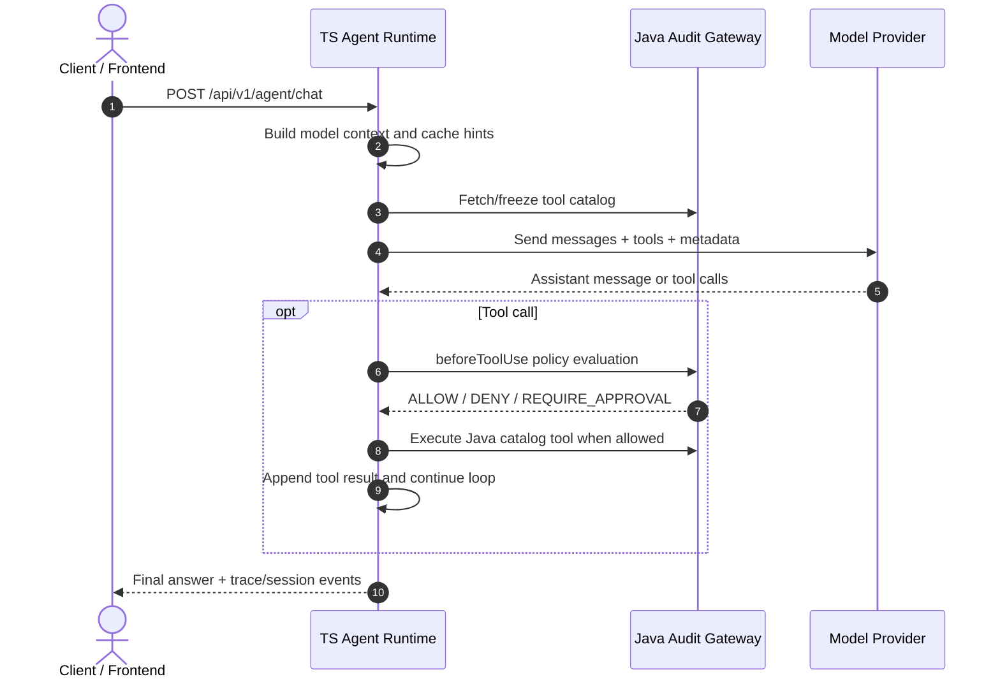

# OpenHarness

[](https://www.typescriptlang.org/)
[](https://www.oracle.com/java/)
[](LICENSE)

OpenHarness is an experimental, OpenSpec-driven AI Agent runtime platform. It combines a TypeScript agent runtime, a Java audit gateway, a React frontend, and a shared schema package to explore secure tool execution, prompt-cache stability, event streaming, long-term memory, and enterprise-grade agent development workflows.

> Status: early-stage runtime prototype. Core runtime, event streaming, memory APIs, OpenSpec specs, and dashboard tooling are actively evolving. Some advanced features, especially Skill Invocation Sandbox and provider-message capability handling, are still under hardening and should not be treated as production-stable yet.

---

## Table of Contents

- [Architecture](#architecture)
- [Features](#features)
- [Project Layout](#project-layout)
- [Service Ownership Blueprint](#service-ownership-blueprint)
- [Prerequisites](#prerequisites)
- [Quick Start](#quick-start)
- [Startup Modes](#startup-modes)
- [Operational Readiness Checklist](#operational-readiness-checklist)
- [Configuration](#configuration)
- [Development and Verification](#development-and-verification)
- [API Examples](#api-examples)
- [Enterprise Integration Blueprint](#enterprise-integration-blueprint)
- [OpenSpec Workflow](#openspec-workflow)
- [Security Notes](#security-notes)
- [Roadmap](#roadmap)
- [License](#license)

---

## Architecture

OpenHarness separates fast agent execution from policy and audit boundaries:

- **TypeScript Agent Runtime**: Fastify-based runtime for agent loops, session events, memory APIs, tool routing, prompt/cache metadata, and frontend-facing APIs.
- **Java Audit Gateway**: Spring Boot service for tool catalog, tool execution, policy evaluation, model-provider routing, and cost metadata.
- **React Frontend**: Vite-based UI for local development and runtime interaction.
- **Shared Schema**: Zod and TypeScript contract package used by runtime, frontend, and tests.
- **OpenSpec + Docs**: Spec-driven change proposals, current capability specs, review records, implementation plans, and project dashboard.



---

## Features

### Implemented / actively tested

- TypeScript agent execution runner with detached SSE-friendly lifecycle.
- Java backend gateway for tool catalog, model calls, tool execution, and policy evaluation.
- Session event store and reconnectable event streaming.
- Long-term memory fact APIs.
- Context builder with budget-aware message selection.
- Prompt registry with static system prompt and session-context metadata.
- Cache hint generation with configurable strategies: `off`, `single`, `double`, `adaptive`.
- OpenSpec-based specs, active changes, archive records, and dashboard generation.

### Experimental / under hardening

- Skill Invocation Sandbox and `invoke_skill` metadata tool injection.
- Provider message capability fallback for synthetic assistant/user message layouts.
- Best-effort shredding for local skill files.

See `docs/review/` for current review findings and risk notes before relying on experimental features.

---

## Project Layout

```text
openharness/
├── agent-runtime/             # TypeScript Agent Runtime (Fastify, Vitest)
│   ├── src/
│   ├── test/
│   └── fixtures/
├── backend/                   # Java 21 Spring Boot audit/model/tool gateway
├── frontend/                  # React + Vite frontend
├── integration-tests/         # Cross-package integration tests
├── packages/shared-schema/    # Shared Zod schemas and TypeScript types
├── openspec/                  # Current specs and proposed/archived changes
├── docs/
│   ├── architecture/          # Architecture notes
│   ├── design/                # Design records and closeouts
│   ├── review/                # Review artifacts
│   ├── superpowers/plans/     # Implementation plans
│   └── project-dashboard/     # Development dashboard source and generated pages
├── .env.example               # Local env template
├── mcp.example.json           # Local MCP config template
└── dev.sh                     # Local all-in-one development launcher
```

---

## Service Ownership Blueprint

OpenHarness is intentionally split into service-sized ownership boundaries. Each service can evolve independently as long as shared contracts stay compatible.

| Service / Module | Runtime | Default Port | Owns | Does not own | Key files |
| --- | --- | ---: | --- | --- | --- |
| Frontend | React + Vite | `5173` | UI, local operator workflows, chat/session interaction, development dashboard surface | Tool execution, provider credentials, policy decisions | `frontend/src/`, `frontend/package.json` |
| Agent Runtime | Node.js + Fastify | `3001` | Agent loop, model context assembly, cache hints, SSE/session events, memory API, approval orchestration, local history storage | Provider credentials, enterprise policy source of truth, Java tool implementations | `agent-runtime/src/server.ts`, `agent-runtime/src/agentExecutionRunner.ts` |
| Java Audit Gateway | Java 21 + Spring Boot | `8080` | Tool catalog, Java tool execution, policy evaluation, provider routing, provider adapter normalization, cost metadata | Frontend UI state, local runtime history files | `backend/src/`, `backend/src/main/resources/application.yml` |
| Shared Schema | TypeScript/Zod | N/A | Cross-runtime request/response schemas, metadata typing, frontend/runtime contract types | Business execution logic | `packages/shared-schema/src/` |
| OpenSpec Specs | Markdown + CLI | N/A | Capability contracts, proposed changes, archived decisions | Runtime execution | `openspec/specs/`, `openspec/changes/` |
| Project Dashboard | JSON + generated MD/HTML | N/A | Development status source of truth and rendered navigation | Runtime behavior | `docs/project-dashboard/development-log.json` |

### Enterprise integration responsibilities

| Concern | Primary owner | Integration point |
| --- | --- | --- |
| Identity / tenant headers | Frontend + Agent Runtime | `X-User-Id`, `X-Tenant-Id` headers |
| Tool visibility | Agent Runtime + Java Gateway | Frozen tool catalog and runtime model-visible tools |
| Tool execution authorization | Java Gateway | `beforeToolUse` / policy evaluation |
| Provider credentials | Java Gateway | `openharness.providers.*.api-key` in backend config |
| Prompt/cache metadata | Agent Runtime | `ModelChatRequest.meta.cacheHints`, prompt metadata |
| Runtime observability | Agent Runtime + Java Gateway | trace IDs, request IDs, session events |
| Persistent runtime data | Agent Runtime | `HISTORY_DATA_DIR`, `MEMORY_DATA_DIR` |
| Spec governance | OpenSpec | `openspec validate`, proposal/review/archive flow |

---

## Prerequisites

- Node.js 18+
- pnpm 8+
- Java JDK 21+
- Maven 3.8+

Recommended checks:

```bash
node --version
pnpm --version
java -version
mvn --version
```

---

## Quick Start

Use this path when you want the full local stack: Java backend, TS Agent Runtime, and React frontend.

```bash
# 1. Clone and enter the repository
git clone https://github.com/Liliang1123/openharness.git
cd openharness

# 2. Install workspace dependencies
pnpm install

# 3. Create local config files
cp .env.example .env
cp mcp.example.json mcp.json  # optional, only if you use local MCP tools

# 4. Start all local services
./dev.sh
```

Default local services:

| Service | URL | Log file |
| --- | --- | --- |
| Frontend | `http://localhost:5173` | `/tmp/oh-frontend.log` |
| Agent Runtime | `http://localhost:3001` | `/tmp/oh-runtime.log` |
| Java Backend | `http://localhost:8080` | `/tmp/oh-backend.log` |

Basic readiness checks:

```bash
# Java backend health
curl http://localhost:8080/actuator/health

# Agent Runtime basic chat endpoint check; requires runtime to be up
curl -X POST http://localhost:3001/api/v1/agent/chat \
  -H "Content-Type: application/json" \
  -H "X-User-Id: user-001" \
  -H "X-Tenant-Id: tenant-001" \
  -d '{"conversationId":"smoke-session","message":"hello","stepBudget":1}'
```

If a service does not start, check logs first:

```bash
tail -f /tmp/oh-backend.log
tail -f /tmp/oh-runtime.log
tail -f /tmp/oh-frontend.log
```

---

## Startup Modes

### Mode 1: Full local stack

```bash
./dev.sh
```

`dev.sh` starts services in dependency order:

1. Java Backend on `8080`.
2. Agent Runtime on `3001`.
3. Frontend on `5173`.

Use this mode for product demos, end-to-end manual testing, and frontend/runtime integration work.

### Mode 2: Start services manually

Use this mode when you need separate terminals, debugger attachment, or service-level log control.

```bash
# Terminal 1: Java Backend
cd backend
mvn spring-boot:run

# Terminal 2: Agent Runtime
pnpm --filter @openharness/agent-runtime dev

# Terminal 3: Frontend
pnpm --filter @openharness/frontend dev
```

### Mode 3: Runtime-only development

Use this mode for unit tests or runtime logic changes that do not require live provider calls.

```bash
pnpm --filter @openharness/agent-runtime test
pnpm --filter @openharness/agent-runtime typecheck
```

### Provider credentials

The backend model router is configured in `backend/src/main/resources/application.yml`. For real provider calls, configure at least one provider key in `.env` or the shell environment:

```bash
ZHIPU_API_KEY=...
SENSENOVA_API_KEY_REAL=...
ANTHROPIC_API_KEY=...
```

If no real key is configured, tests and mocked flows can still run, but live model calls may fail or return provider errors.

---

## Operational Readiness Checklist

Before using OpenHarness in a team or enterprise integration environment, verify each service has an owner, configuration, and test path.

| Area | Minimum local readiness | Enterprise hardening direction |
| --- | --- | --- |
| Frontend | `pnpm --filter @openharness/frontend dev` starts; `VITE_AGENT_RUNTIME_URL` points to runtime | SSO/session integration, tenant-aware UI, audit views |
| Agent Runtime | `PORT`, `JAVA_BACKEND_URL`, `HISTORY_DATA_DIR` configured; runtime tests pass | Durable storage backend, metrics, structured logs, horizontal session strategy |
| Java Backend | `/actuator/health` passes; provider keys configured when needed | Secret manager, provider failover, policy engine integration, gateway auth |
| Shared Schema | `pnpm --filter @openharness/shared-schema typecheck` passes | Backward-compatible schema versioning and release process |
| OpenSpec | `npx openspec validate --all --strict --no-interactive` passes | Proposal approval gate and archive discipline |
| Dashboard | `pnpm dashboard:check` passes | CI check on generated dashboard freshness |
| Security | `.env`, `mcp.json`, runtime data ignored by Git | Key rotation, tenant isolation, policy audit trail |

---

## Configuration

Copy `.env.example` to `.env` and adjust local values as needed.

Important environment variables:

| Variable | Default | Owner | Purpose |
| --- | --- | --- | --- |
| `PORT` | `3001` | Agent Runtime | Agent Runtime HTTP port |
| `HOST` | `0.0.0.0` | Agent Runtime | Agent Runtime listen host |
| `FRONTEND_URL` | `http://localhost:5173` | Agent Runtime | CORS origin for frontend |
| `JAVA_BACKEND_URL` | `http://localhost:8080` | Agent Runtime | Java backend URL |
| `OPENHARNESS_SERVICE_TOKEN` | `dev-service-token` | Agent Runtime / Backend | Local service token |
| `HISTORY_STORE` | `file` | Agent Runtime | `file` or `memory` history backend |
| `HISTORY_DATA_DIR` | `agent-runtime/data/sessions` | Agent Runtime | Local session storage path |
| `MEMORY_DATA_DIR` | `agent-runtime/data/memory` | Agent Runtime | Local memory storage path |
| `CACHE_STRATEGY` | `double` | Agent Runtime | Cache hint strategy |
| `OPENHARNESS_SKILLS_ENABLED` | `false` | Agent Runtime | Enable experimental skill metadata tool |
| `MCP_REQUIRE_APPROVAL` | `false` | Agent Runtime | Require approval for MCP tools |
| `VITE_AGENT_RUNTIME_URL` | `http://localhost:3001` | Frontend | Frontend runtime endpoint |
| `ZHIPU_API_KEY` | unset | Java Backend | Zhipu/OpenAI-compatible provider key |
| `SENSENOVA_API_KEY_REAL` | unset | Java Backend | SenseNova provider key |
| `ANTHROPIC_API_KEY` | unset | Java Backend | Anthropic provider key |

Local-only files intentionally ignored by Git:

```text
.env
mcp.json
agent-runtime/data/
agent-runtime/skills/
docs/handoffs/latest.md
docs/handoffs/local/
```

---

## Development and Verification

### TypeScript checks

```bash
pnpm typecheck
```

Targeted Agent Runtime typecheck:

```bash
pnpm --filter @openharness/agent-runtime typecheck
```

### Tests

```bash
# Full JS/TS workspace tests
pnpm test

# Agent Runtime only
pnpm --filter @openharness/agent-runtime test

# Java backend tests
mvn test -f backend/pom.xml
```

Some HTTP/SSE tests open local loopback ports. If you run them in a restricted sandbox, `listen EPERM 127.0.0.1` indicates environment limitation rather than an application assertion failure.

### OpenSpec validation

```bash
npx openspec validate --all --strict --no-interactive
```

### Dashboard validation

```bash
pnpm dashboard:check
```

---

## API Examples

Agent Runtime defaults to `http://localhost:3001`.

### Synchronous chat

```bash
curl -X POST http://localhost:3001/api/v1/agent/chat \
  -H "Content-Type: application/json" \
  -H "X-User-Id: user-001" \
  -H "X-Tenant-Id: tenant-001" \
  -d '{
    "conversationId": "session-123456",
    "message": "Hello, summarize the current project structure.",
    "agentId": "default-agent",
    "stepBudget": 10
  }'
```

### Streaming chat

```bash
curl -N -X POST http://localhost:3001/api/v1/agent/chat/stream \
  -H "Content-Type: application/json" \
  -H "X-User-Id: user-001" \
  -H "X-Tenant-Id: tenant-001" \
  -d '{
    "conversationId": "session-123456",
    "message": "Run a short agent task.",
    "agentId": "default-agent"
  }'
```

### Reconnect to session events

```bash
curl -N http://localhost:3001/api/v1/sessions/session-123456/events \
  -H "X-Tenant-Id: tenant-001"
```

### Memory facts

```bash
curl -X PUT http://localhost:3001/api/v1/memory/facts \
  -H "Content-Type: application/json" \
  -H "X-User-Id: user-001" \
  -H "X-Tenant-Id: tenant-001" \
  -d '{
    "memoryId": "fact-001",
    "content": "The user prefers TypeScript for backend development.",
    "tags": ["preference", "typescript"]
  }'

curl "http://localhost:3001/api/v1/memory/facts?query=typescript" \
  -H "X-User-Id: user-001" \
  -H "X-Tenant-Id: tenant-001"
```

---

## Enterprise Integration Blueprint

OpenHarness is organized so enterprise integrations can be added incrementally without collapsing all responsibilities into one runtime.

### Phase 1: Local developer runtime

- Use file-based history and memory storage.
- Use local `.env` and `mcp.json`.
- Validate changes with unit tests, OpenSpec, and dashboard checks.

### Phase 2: Team-shared development environment

- Move provider keys to a secret manager.
- Add explicit gateway authentication between Agent Runtime and Java Backend.
- Store session history and memory in durable infrastructure instead of local files.
- Add CI checks for `pnpm typecheck`, `pnpm test`, backend tests, OpenSpec validation, and dashboard freshness.

### Phase 3: Enterprise policy integration

- Connect `beforeToolUse` to enterprise policy systems.
- Add approval workflows for sensitive/destructive tools.
- Add tenant-level tool visibility and model routing rules.
- Capture audit events for model calls, tool calls, approvals, and denials.

### Phase 4: Production runtime hardening

- Define service-level SLOs for frontend, runtime, gateway, and provider adapters.
- Add structured logging, metrics, tracing, and alerting.
- Add provider fallback and cost governance.
- Harden skill execution, MCP tools, sandboxing, and data-retention policies.

### Iteration model

Major capability changes should follow this path:

```text
OpenSpec proposal -> design review -> implementation plan -> code/tests -> verification -> archive -> dashboard sync
```

This keeps public behavior, runtime contracts, and enterprise integration assumptions reviewable over time.

---

## OpenSpec Workflow

OpenHarness keeps runtime behavior and architectural changes under `openspec/`:

```text
openspec/specs/                 # Current accepted capabilities
openspec/changes/               # Proposed and active changes
openspec/changes/archive/       # Archived completed changes
```

Useful commands:

```bash
npx openspec list
npx openspec list --specs
npx openspec validate --all --strict --no-interactive
```

For major behavior, architecture, security, provider-contract, or runtime-lifecycle changes, create or update an OpenSpec change before implementation.

---

## Security Notes

- Do not commit `.env`, `mcp.json`, credentials, private keys, local session data, or local skill caches.
- `mcp.example.json` is a template. Copy it to `mcp.json` for local use.
- `agent-runtime/data/` can contain user messages, tool outputs, memory facts, and approval/session state. It is ignored by Git.
- Experimental skill execution features should be reviewed carefully before using them with sensitive workloads.
- For security-sensitive changes, prefer explicit OpenSpec proposals and review artifacts under `docs/review/`.

---

## Roadmap

Current focus areas include:

- Hardening Skill Invocation Sandbox contracts and type safety.
- Provider message capability modeling.
- Safer local skill storage and cleanup semantics.
- Subagent dispatching and isolated execution workflows.
- More complete frontend runtime observability.
- Enterprise policy gateway integration and operational hardening.

See `docs/vision/`, `docs/design/`, `docs/review/`, and `openspec/changes/` for the current planning trail.

---

## License

Apache License 2.0. See [LICENSE](LICENSE).
