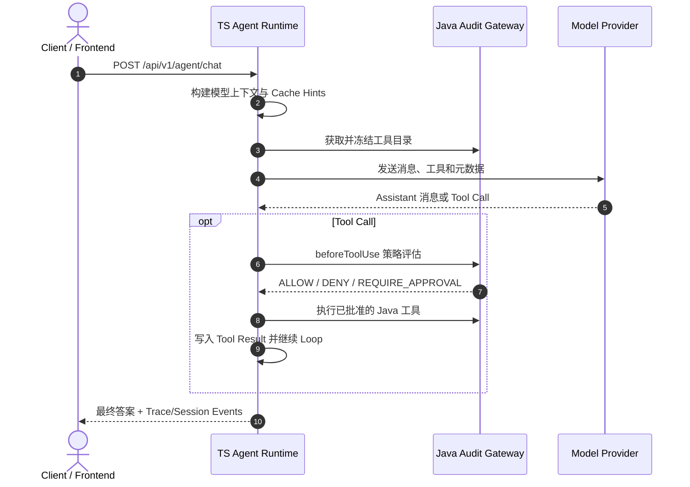

# OpenHarness

[](https://www.typescriptlang.org/)
[](https://www.oracle.com/java/)
[](LICENSE)

[English](README.md) · 中文说明

OpenHarness 是一个实验性的、由 OpenSpec 驱动的 AI Agent 运行时平台。它由
TypeScript Agent Runtime、Java 审计网关、React 前端和共享 Schema 包组成，用于探索
安全工具执行、Prompt Cache 稳定性、事件流、长期记忆以及企业级 Agent 开发流程。

> 当前状态：早期运行时原型。核心 Runtime、事件流、记忆 API、OpenSpec 规格和开发导航台仍在持续演进。Skill Invocation Sandbox、Provider Message 能力处理和真实 Provider 资格验证等能力仍在加固，不能视为生产就绪。仓库当前没有发布可安装的官方 `openharness` 产品 CLI；本地 wrapper 只是运维便利工具。

## 目录

- [项目范围与状态](#项目范围与状态)
- [架构](#架构)
- [功能](#功能)
- [项目结构](#项目结构)
- [服务职责](#服务职责)
- [前置环境](#前置环境)
- [快速开始](#快速开始)
- [启动方式](#启动方式)
- [运行就绪检查](#运行就绪检查)
- [配置](#配置)
- [Runtime API](#runtime-api)
- [开发与验证](#开发与验证)
- [API 示例](#api-示例)
- [故障排查](#故障排查)
- [企业集成路线](#企业集成路线)
- [贡献与变更治理](#贡献与变更治理)
- [OpenSpec 工作流](#openspec-工作流)
- [安全说明](#安全说明)
- [路线图](#路线图)
- [许可证](#许可证)

## 项目范围与状态

### 仓库当前提供的能力

- TypeScript Agent Runtime：接收 Agent turn、构建模型上下文、协调工具、持久化会话事件，并提供 HTTP/SSE API。
- Java Spring Boot 网关：负责 Provider Adapter、工具目录/执行、策略评估、Trace 接收、Provider 路由和成本元数据。
- React/Vite 前端：支持本地聊天、会话恢复、审批和执行活动查看。
- 共享 Zod/TypeScript 契约、OpenSpec 能力规格、review 记录、评估 fixture、资格验证 harness 和生成式项目导航台。

### 当前明确不承诺的内容

- 不是生产就绪的托管服务、多实例部署方案或企业身份产品。
- 没有稳定的公开 `openharness` CLI、包仓库发布物、升级通道或 shell completion 契约。需要本地操作便利时，请阅读[本地 wrapper 指南](docs/guides/openharness-local-cli-wrapper.md)。
- `dev.sh` 是本地开发启动器，不是生产 Supervisor；默认存储和 Provider 配置面向开发环境。
- 单元测试、集成测试或本地资格报告只证明各自覆盖范围，不等于平台整体生产认证。
- 当前默认工具目录以读操作为主，没有批准的工作区写入/编辑或 Skill 创建能力。

## 架构

OpenHarness 将快速 Agent 执行与策略、审计边界拆分开：

- **TypeScript Agent Runtime**：基于 Fastify，负责 Agent Loop、会话事件、记忆 API、工具路由、Prompt/Cache 元数据和面向前端的接口。
- **Java Audit Gateway**：基于 Spring Boot，负责工具目录、工具执行、策略评估、模型 Provider 路由、Provider Adapter 归一化和成本元数据。
- **React Frontend**：基于 Vite，用于本地开发和 Runtime 交互。
- **Shared Schema**：Runtime、Frontend 和测试共同使用的 Zod/TypeScript 契约包。
- **OpenSpec + Docs**：规格驱动的变更提案、当前能力规格、review、实施计划、归档记录和项目导航台。



## 功能

### 已实现并持续测试

- TypeScript Agent Execution Runner，支持与 SSE 配合的 detached 生命周期：客户端断开不会取消已经接收的执行。
- Durable Session Events：带 Event ID、终态 `stream_done` / `stream_error`、游标重放、重放缺口信号和 Runtime Progress Snapshot。
- 执行控制：同一会话单活跃执行、工具审批、Abort、执行超时、审批超时和 Step Budget 耗尽。
- Java 网关：工具目录、模型调用、工具执行、策略评估、Trace 接收、Provider 路由和成本元数据。
- MCP stdio 集成：惰性 Server 生命周期、工具名/配置校验、结果脱敏，以及可选的组织级审批强制开关。
- 长期记忆 Fact API，以及本地开发和生产 Runtime profile 使用的文件/SQLite Runtime 存储。
- 上下文构建：预算感知消息选择、自动压缩、Prompt Registry 元数据和可配置 Cache Hint 策略：`off`、`single`、`double`、`adaptive`。
- 前端 Execution Activity Group：展示模型/工具进度和安全终态标识，不展示原始 Provider body 或任意异常文本。
- 可选 Codex app-server Provider 边界和 Provider 级 `reasoning-effort`；OAuth 始终由官方 Codex CLI 管理，OpenHarness 不读取凭据。
- OpenSpec 规格、活动变更、归档记录、评估 fixture、资格验证 harness、review 产物和 Dashboard 生成。

### 实验性/持续加固

- Skill Invocation Sandbox 和 `invoke_skill` 元数据工具注入。
- 针对合成 Assistant/User 消息布局的 Provider Message 能力 fallback。
- 本地 Skill 文件的尽力清理/粉碎。
- 真实 Provider 和 Codex 资格验证流程：需要独立凭据、操作员授权、固定 Provider/Client 证据以及对应 Gate C/D runbook。

依赖实验性能力前，请先查看 `docs/review/` 中的风险说明。

## 项目结构

```text
openharness/
├── agent-runtime/             # TypeScript Agent Runtime（Fastify、Vitest）
│   ├── src/
│   ├── test/
│   └── fixtures/
├── backend/                   # Java 21 Spring Boot 审计/模型/工具网关
├── frontend/                  # React + Vite 前端
├── integration-tests/         # 跨包集成测试
├── packages/shared-schema/    # 共享 Zod Schema 与 TypeScript 类型
├── openspec/                  # 当前规格、提案和归档变更
├── docs/
│   ├── architecture/          # 架构和契约
│   ├── design/                # 设计记录与 closeout
│   ├── guides/                # 运维与本地集成指南
│   ├── review/                # Review 产物
│   ├── superpowers/plans/     # 已批准的实施计划
│   └── project-dashboard/     # Dashboard 数据源和生成页面
├── .env.example               # 本地环境变量模板
├── mcp.example.json           # 本地 MCP 配置模板
├── README.md                  # English README
└── dev.sh                     # 本地一键开发启动器
```

Runtime 入口重点关注：`agent-runtime/src/server.ts`、
`agent-runtime/src/agentExecutionRunner.ts`、`agent-runtime/src/agentStreamLoop.ts`
和 `agent-runtime/src/productionEntrypoint.ts`。Java 网关和 Provider 边界位于
`backend/src/main/java/org/openharness/backend/api/` 与
`backend/src/main/java/org/openharness/backend/service/provider/`。

## 服务职责

OpenHarness 按服务边界拆分职责。只要共享契约保持兼容，各服务可以独立演进。

| 服务/模块 | 技术栈 | 默认端口 | 负责内容 | 不负责内容 |
| --- | --- | ---: | --- | --- |
| Frontend | React + Vite | `5173` | UI、本地操作流、聊天/会话交互、Dashboard 展示 | 工具执行、Provider 凭据、策略决策 |
| Agent Runtime | Node.js + Fastify | `3001` | Agent Loop、上下文、Cache Hint、SSE/Session Events、记忆 API、审批编排、本地历史 | Provider 凭据、企业策略事实源、Java 工具实现 |
| Java Audit Gateway | Java 21 + Spring Boot | `8080` | 工具目录、Java 工具、策略评估、Provider 路由/Adapter、成本元数据 | 前端状态、本地 Runtime 历史文件 |
| Shared Schema | TypeScript/Zod | N/A | 请求/响应 Schema、元数据和跨运行时类型 | 业务执行逻辑 |
| OpenSpec | Markdown + CLI | N/A | 能力契约、提案、决策和归档 | Runtime 执行 |
| Project Dashboard | JSON + 生成的 MD/HTML | N/A | 开发状态数据源和导航页面 | Runtime 行为 |

跨服务关键职责：

| 关注点 | 主要拥有者 | 集成点 |
| --- | --- | --- |
| Identity/Tenant | Frontend + Agent Runtime | `X-User-Id`、`X-Tenant-Id` |
| 工具可见性 | Agent Runtime + Java Gateway | 冻结后的工具目录和模型可见工具 |
| 工具执行授权 | Java Gateway | `beforeToolUse` / policy evaluate |
| Provider 凭据 | Java Gateway | `openharness.providers.*.api-key` |
| Prompt/Cache 元数据 | Agent Runtime | `ModelChatRequest.meta.cacheHints` |
| Runtime 可观测性 | Agent Runtime + Java Gateway | Trace ID、Request ID、Session Events |
| 持久化 Runtime 数据 | Agent Runtime | `HISTORY_DATA_DIR`、`MEMORY_DATA_DIR` |
| 规格治理 | OpenSpec | `openspec validate`、提案/审核/归档流程 |

## 前置环境

- Node.js 20+（当前开发 runbook 和 CI 目标版本）
- pnpm 8+
- Java JDK 21+
- Maven 3.8+
- `curl` 和可运行 `dev.sh` 的 Unix-like shell
- 用于打开本地前端的浏览器
- 可选：需要 Codex Provider 时安装官方 Codex CLI

检查版本：

```bash
node --version
pnpm --version
java -version
mvn --version
```

## 快速开始

### 启动完整本地栈

```bash
# 1. 获取仓库
git clone https://github.com/Liliang1123/openharness.git
cd openharness

# 2. 按锁文件安装依赖
pnpm install --frozen-lockfile

# 3. 创建本地配置
cp .env.example .env
cp mcp.example.json mcp.json  # 可选：仅在需要本地 MCP 工具时复制

# 4. 启动 Java、TS Runtime 和 Frontend
./dev.sh
```

默认服务：

| 服务 | 地址 | 日志 |
| --- | --- | --- |
| Frontend | `http://localhost:5173` | `/tmp/oh-frontend.log` |
| Agent Runtime | `http://localhost:3001` | `/tmp/oh-runtime.log` |
| Java Backend | `http://localhost:8080` | `/tmp/oh-backend.log` |

就绪检查：

```bash
# Java 健康检查
curl http://localhost:8080/actuator/health

# Runtime readiness；开发模式 Hook 至少要求 X-User-Id
curl http://localhost:3001/api/v1/health/ready \
  -H "X-User-Id: user-001" \
  -H "X-Tenant-Id: tenant-001"

# 最小聊天验证；Runtime 和 Backend 都应已就绪
curl -X POST http://localhost:3001/api/v1/agent/chat \
  -H "Content-Type: application/json" \
  -H "X-User-Id: user-001" \
  -H "X-Tenant-Id: tenant-001" \
  -H "X-Trace-Id: trace-smoke-001" \
  -H "X-Request-Id: request-smoke-001" \
  -d '{"conversationId":"smoke-session","message":"hello","stepBudget":1}'
```

`dev.sh` 会加载 `.env`（如果存在），依次启动 Java Backend、Agent Runtime 和
Frontend，并将子进程绑定在当前 shell。按 `Ctrl+C` 停止服务。该脚本使用固定端口
和短暂的 Backend 等待时间，发送聊天请求前请始终确认 readiness。

## 启动方式

### 方式 1：完整本地栈

```bash
./dev.sh
```

适用于产品演示、端到端手工测试和前端/Runtime 联调。

### 方式 2：手动启动

```bash
# Terminal 1：Java Backend
cd backend
mvn spring-boot:run

# Terminal 2：Agent Runtime
pnpm --filter @openharness/agent-runtime dev

# Terminal 3：Frontend
pnpm --filter @openharness/frontend dev
```

适用于调试器接入、服务级日志控制和只启动部分服务。

### 方式 3：仅运行 Runtime 测试

```bash
pnpm --filter @openharness/agent-runtime test
pnpm --filter @openharness/agent-runtime typecheck
```

### 方式 4：用户本地 operator wrapper

仓库没有官方可安装的 `openharness` CLI。若已经按
[`docs/guides/openharness-local-cli-wrapper.md`](docs/guides/openharness-local-cli-wrapper.md)
安装用户本地 wrapper，可使用：

```text
openharness doctor
openharness up
openharness status
openharness logs [backend|runtime|frontend|all]
openharness chat "your message" [conversation-id]
openharness down
```

wrapper 只负责启动和观察现有本地栈，不新增 Runtime API、不拥有 Provider 凭据，
也不是稳定的产品兼容契约。每次源码或配置更新后都应先运行 `doctor`。

### Provider 凭据

默认 Provider 配置在 `backend/src/main/resources/application.yml`：

```bash
ZHIPU_API_KEY=...
# 默认 zhipu Provider 还接受 SENSENOVA_API_KEY 作为 legacy fallback
SENSENOVA_API_KEY_REAL=...
ANTHROPIC_API_KEY=...
```

当前提交的默认 Provider 是 `zhipu`，默认路由包含 `glm-4.7-flash`、
`glm-4-flash`、`SenseChat-5` 和已配置的 Anthropic 模型。默认 YAML 没有启用
Codex app-server；启用它必须添加显式 Provider、显式 `openai-codex/<model>` 路由、
本地官方 Codex CLI 和操作员授权。没有真实 key 时，测试和 mock 流程仍可运行，但
真实模型调用可能返回结构化 Provider 错误。

## 运行就绪检查

| 区域 | 本地最低条件 | 企业加固方向 |
| --- | --- | --- |
| Frontend | Frontend 能启动，`VITE_AGENT_RUNTIME_URL` 指向 Runtime | SSO/Session、租户感知 UI、审计视图 |
| Agent Runtime | 配置 `PORT`、`JAVA_BACKEND_URL`、`HISTORY_DATA_DIR`，Runtime 测试通过 | Durable Storage、指标、结构化日志、多实例会话策略 |
| Java Backend | `/actuator/health` 通过，需要时配置 Provider key | Secret Manager、Provider failover、策略引擎、网关认证 |
| Shared Schema | Schema typecheck 通过 | 向后兼容的 Schema 版本和发布流程 |
| OpenSpec | strict validate 通过 | 提案批准门禁和归档纪律 |
| Dashboard | `pnpm dashboard:check` 通过 | CI 检查生成产物未过期 |
| Security | `.env`、`mcp.json`、Runtime 数据被 Git 忽略 | Key 轮换、租户隔离、策略审计链 |

以上只是开发和受控评估的就绪清单，不是生产部署批准。共享或生产环境还需按
对应 Runtime runbook 核对存储、身份、Provider、策略、可观测性和回滚要求。

## 配置

```bash
cp .env.example .env
```

主要环境变量：

| 变量 | 默认值 | 所属 | 用途 |
| --- | --- | --- | --- |
| `PORT` | `3001` | Agent Runtime | Runtime HTTP 端口 |
| `HOST` | `0.0.0.0` | Agent Runtime | Runtime 监听地址 |
| `FRONTEND_URL` | `http://localhost:5173` | Agent Runtime | CORS 允许的 Frontend Origin |
| `JAVA_BACKEND_URL` | `http://localhost:8080` | Agent Runtime | Java Backend 地址 |
| `OPENHARNESS_SERVICE_TOKEN` | `dev-service-token` | Runtime/Backend | 本地服务凭据 |
| `AGENT_RUNTIME_REQUIRE_SERVICE_AUTH` | 开发默认 `false` | Agent Runtime | 是否要求 Bearer Service Token 和完整关联 Header；生产入口开启严格模式 |
| `HISTORY_STORE` | `file` | Agent Runtime | `file` 或 `memory` 历史存储 |
| `HISTORY_DATA_DIR` | `agent-runtime/data/sessions` | Agent Runtime | 会话数据路径 |
| `MEMORY_DATA_DIR` | `agent-runtime/data/memory` | Agent Runtime | 记忆数据路径 |
| `COMPRESSION_AUTO` | `true` | Agent Runtime | 自动上下文压缩 |
| `COMPRESSION_THRESHOLD` | `8000` | Agent Runtime | 压缩阈值 |
| `KEEP_RECENT_MESSAGES` | `6` | Agent Runtime | 压缩摘要旁保留的近期消息数 |
| `MODEL_CONTEXT_BUDGET_TOKENS` | `8000` | Agent Runtime | Context Builder 预算 |
| `AGENT_STEP_BUDGET` | `25` | Agent Runtime | Agent Loop 默认最大步数 |
| `CACHE_STRATEGY` | `double` | Agent Runtime | Cache Hint 策略 |
| `OPENHARNESS_PROMPT_REF` | `openharness-default@v1` | Agent Runtime | Prompt Registry 引用 |
| `OPENHARNESS_SKILLS_ENABLED` | `false` | Agent Runtime | 开启实验性 Skill 元数据工具 |
| `MCP_REQUIRE_APPROVAL` | `false` | Agent Runtime | 对 MCP 工具强制要求审批 |
| `EXECUTION_TIMEOUT_MS` | `1800000` | Agent Runtime | 执行超时，毫秒 |
| `APPROVAL_TIMEOUT_MS` | `3600000` | Agent Runtime | 审批超时，毫秒 |
| `TOOL_WORKSPACE_DIR` | `/tmp/openharness-tool-workspace` | Runtime/Java 工具 | 本地工具工作区边界 |
| `VITE_AGENT_RUNTIME_URL` | `http://localhost:3001` | Frontend | Runtime 地址 |
| `VITE_DEV_USER_ID` | `user-001` | Frontend | 开发身份 Header |
| `VITE_DEV_TENANT_ID` | `tenant-001` | Frontend | 开发租户 Header |
| `BACKEND_URL` | `http://127.0.0.1:18081` | 集成测试 | 可选 fake Backend 地址 |
| `AGENT_RUNTIME_URL` | `http://127.0.0.1:13001` | 集成测试 | 可选 fake Runtime 地址 |
| `ZHIPU_API_KEY` | 未设置 | Java Backend | Zhipu/OpenAI-compatible key |
| `SENSENOVA_API_KEY` | 未设置 | Java Backend | 默认 zhipu Provider 的 legacy fallback |
| `SENSENOVA_API_KEY_REAL` | 未设置 | Java Backend | SenseNova key |
| `ANTHROPIC_API_KEY` | 未设置 | Java Backend | Anthropic key |

以下本地文件不应提交：

```text
.env
mcp.json
agent-runtime/data/
agent-runtime/skills/
docs/handoffs/latest.md
docs/handoffs/local/
```

### Frontend Origin 注意事项

浏览器请打开 `http://localhost:5173`。不要直接使用 `http://127.0.0.1:5173`，
除非你已将该 Origin 加入 `FRONTEND_URL`；页面可能能够加载，但聊天请求会因 Runtime
CORS allowlist 不包含该 Origin 而出现 `Failed to fetch`。

### 可选 Codex app-server 配置

Codex 是显式 Provider 选项，不是默认 fallback。Backend 配置可以类似：

```yaml
openharness:
  model-router:
    routes:
      openai-codex/gpt-5.6-sol: openai-codex
  providers:
    - name: openai-codex
      type: codex-app-server
      command: codex
      app-server-args: ["app-server"]
      endpoint: stdio://
      models: ["gpt-5.6-sol"]
      reasoning-effort: high
```

`reasoning-effort` 属于 Provider 配置，通过 app-server 协议发送，不进入 TS Runtime
或 Frontend 请求契约。缺省时 Codex turn 使用 `medium`。不安全值、在非 Codex
Provider 上配置该字段、远程 endpoint、没有显式路由的 Codex Provider 都会在 Backend
校验阶段 fail closed。OAuth 登录、刷新、凭据存储和退出登录全部由官方 Codex CLI
负责，OpenHarness 不读取、复制、打印或转发 Codex 凭据。请先阅读
[`docs/architecture/auth_contract.md`](docs/architecture/auth_contract.md) 和
[`docs/architecture/dev_runbook.md`](docs/architecture/dev_runbook.md)。

## Runtime API

本地 TypeScript Runtime 默认监听 `http://localhost:3001`。请求按
`(tenantId, userId, conversationId)` 隔离，即使开发模式可以补齐部分 ID，也建议始终
显式传递：

```text
X-User-Id: user-001
X-Tenant-Id: tenant-001
X-Trace-Id: trace-001
X-Request-Id: request-001
Authorization: Bearer <service-token>  # 生产严格模式
```

所有 Runtime 路由当前都要求 `X-User-Id`。生产入口还要求有效 Bearer Service Token
以及四个身份/关联 Header。开发模式使用默认 Service Token，并可生成缺失的 tenant、
trace、request ID，但客户端不应依赖这个行为。

### TypeScript Runtime 路由

| 方法与路径 | 用途 | 响应/终态说明 |
| --- | --- | --- |
| `GET /api/v1/health/ready` | Readiness 探针 | `200 {status:"ready"}` 或 `503` + 稳定 reason |
| `POST /api/v1/agent/chat` | 同步 Agent turn | 等待 detached runner，返回 answer、Trace event kinds、ID、usage 和可选 `stopReason` |
| `POST /api/v1/agent/chat/stream` | SSE Agent turn | `200` 前先完成 admission；直到 `stream_done` 或 `stream_error` 发出 Durable Events |
| `POST /api/v1/agent/ask-user/:askUserId/reply` | 旧版审批兼容接口 | 支持 `approve`、`reject`、`revise`；新客户端应使用 Session 审批接口 |
| `GET /api/v1/memory/facts` | 列出/搜索 Memory Fact | 查询参数 `query` 和 `tags` |
| `PUT /api/v1/memory/facts` | Upsert Memory Fact | Body 为 `content`，可选 `memoryId`/`agentId`/`tags` |
| `DELETE /api/v1/memory/facts/:memoryId` | 删除 Memory Fact | 返回 `{memoryId, deleted}`；不存在返回 `404` |
| `GET /api/v1/sessions` | 列出会话 | 按调用方 tenant/user 隔离 |
| `GET /api/v1/sessions/:conversationId` | 恢复会话 | 返回消息、活跃执行、Runtime Progress 和待审批项 |
| `GET /api/v1/sessions/:conversationId/events` | Replay/Live SSE | 可选 `last_event_id`；游标不可用时发 `stream_resync_required` |
| `POST /api/v1/sessions/:conversationId/executions/:executionId/approvals/:toolCallId` | 决定工具审批 | Body action 为 `approve`、`reject` 或 `revise`；已处理返回 `409` |
| `POST /api/v1/sessions/:conversationId/executions/:executionId/abort` | 中止执行 | 对已终态执行幂等；终态错误类为 `EXECUTION_ABORTED` |
| `DELETE /api/v1/sessions/:conversationId` | 删除本地会话历史 | 返回 `204`，属于数据变更 |

### Chat 请求与响应

`POST /api/v1/agent/chat` 和 `/stream` 接受：

```json
{
  "conversationId": "session-123456",
  "message": "总结当前项目结构。",
  "agentId": "default-agent",
  "stepBudget": 10
}
```

只有 `conversationId` 和 `message` 必填。默认 Agent 是 `default-agent`；未知
`agentId` 会被拒绝；`stepBudget` 限制本次 Agent Loop 最大步数。

同步响应示例：

```json
{
  "conversationId": "session-123456",
  "answer": "...",
  "traceId": "trace-001",
  "requestId": "request-001",
  "trace": {"events": ["agent_start", "model_call_start", "final_answer"]},
  "usage": {"costUsdMicros": 0},
  "stopReason": "FINAL_ANSWER"
}
```

终态错误/限制类包括：`MODEL_ERROR`、`TOOL_ERROR`、`POLICY_DENY`、
`APPROVAL_TIMEOUT`、`EXECUTION_TIMEOUT`、`STEP_BUDGET_EXHAUSTED`、
`EVENT_REPLAY_GAP`、`EXECUTION_ABORTED`、`EXECUTION_INTERRUPTED` 和
`EMPTY_MODEL_RESPONSE`。

### SSE 与 Replay 语义

- `/api/v1/agent/chat/stream` 转发 Durable Session Events，包含 `eventId`、
  `executionId`、`conversationId`、tenant/user、Trace/Request ID、时间戳和 `data`。
- 事件名包括 `agent_start`、`model_call_start`、`model_call_end`、`tool_call`、
  `tool_result`、`approval_requested`、`final_answer`、`stream_done` 和
  `stream_error`。
- Preview Delta 是 transient；恢复来源是 Durable Events。客户端断开只停止转发，
  已 admission 的 Runner 仍会继续并写入终态。
- 使用 `GET /api/v1/sessions/:conversationId/events?last_event_id=<上次事件ID>`
  重连。服务端会重放游标之后的事件并订阅新事件；游标缺失时发出
  `stream_resync_required`，客户端应从 Session Snapshot 或已知边界恢复。
- `stream_done` 表示正常结束；`stream_error` 携带稳定的 `errorClass`。原始 Provider
  响应和任意异常文本不是客户端契约。

### Java Gateway 内部边界

`http://localhost:8080` 上的 Java 服务是 TS Runtime 的内部网关，受 Service Token
契约保护，不应从浏览器直接调用：

| 方法与路径 | 负责内容 |
| --- | --- |
| `GET /actuator/health` | Spring Boot 健康检查 |
| `GET /api/v1/tools/catalog` | 工具目录 |
| `POST /api/v1/tools/execute` / `cancel` | 工具执行生命周期 |
| `POST /api/v1/policies/tool-review/evaluate` | 策略决策 |
| `POST /api/v1/model/chat` / `cancel` / `compress` | Provider 模型调用和压缩 |
| `POST /api/v1/model/codex/turns/{bridgeId}/tool-result` / `cancel` | Codex app-server Bridge |
| `POST /api/v1/trace/events` | Trace/Outbox 接收 |

精确请求 Schema 位于 `packages/shared-schema/` 和 Java Model Contract。不要从前端
暴露 Provider Key，也不要绕过 TS Runtime 的工具目录和策略链路直接调用这些内部接口。

## 开发与验证

### TypeScript 检查

```bash
pnpm typecheck
pnpm --filter @openharness/agent-runtime typecheck
```

### 测试

```bash
# 完整 JS/TS workspace 测试
pnpm test

# 仅 Runtime
pnpm --filter @openharness/agent-runtime test

# Java Backend
mvn -f backend/pom.xml test

# 可选：确定性评估 smoke
pnpm --filter @openharness/agent-runtime eval:smoke
```

部分 HTTP/SSE 测试会监听本机回环端口。若受限 Sandbox 报
`listen EPERM 127.0.0.1`，先判断是否为环境限制，不要直接当作应用断言失败。

### OpenSpec 与 Dashboard

```bash
npx openspec validate --all --strict --no-interactive
pnpm dashboard:check
```

可选资格验证入口需要匹配 fixture、环境变量和证据策略，不能替代生产审批：

```bash
pnpm --filter @openharness/agent-runtime qualification:gate-c-provider
pnpm --filter @openharness/agent-runtime qualification:gate-d-preflight
pnpm --filter @openharness/agent-runtime diagnostic:gate-d-performance
```

## API 示例

### 同步聊天

```bash
curl -X POST http://localhost:3001/api/v1/agent/chat \
  -H "Content-Type: application/json" \
  -H "X-User-Id: user-001" \
  -H "X-Tenant-Id: tenant-001" \
  -H "X-Trace-Id: trace-chat-001" \
  -H "X-Request-Id: request-chat-001" \
  -d '{
    "conversationId": "session-123456",
    "message": "请总结当前项目结构。",
    "agentId": "default-agent",
    "stepBudget": 10
  }'
```

### 流式聊天

```bash
curl -N -X POST http://localhost:3001/api/v1/agent/chat/stream \
  -H "Content-Type: application/json" \
  -H "X-User-Id: user-001" \
  -H "X-Tenant-Id: tenant-001" \
  -H "X-Trace-Id: trace-stream-001" \
  -H "X-Request-Id: request-stream-001" \
  -d '{
    "conversationId": "session-123456",
    "message": "运行一个简短的 Agent 任务。",
    "agentId": "default-agent"
  }'
```

### 重连 Session Events

```bash
curl -N "http://localhost:3001/api/v1/sessions/session-123456/events?last_event_id=<上一次事件ID>" \
  -H "X-User-Id: user-001" \
  -H "X-Tenant-Id: tenant-001" \
  -H "X-Trace-Id: trace-reconnect-001" \
  -H "X-Request-Id: request-reconnect-001"
```

### Memory Facts

```bash
curl -X PUT http://localhost:3001/api/v1/memory/facts \
  -H "Content-Type: application/json" \
  -H "X-User-Id: user-001" \
  -H "X-Tenant-Id: tenant-001" \
  -d '{
    "memoryId": "fact-001",
    "content": "用户偏好使用 TypeScript 开发后端。",
    "tags": ["preference", "typescript"]
  }'

curl "http://localhost:3001/api/v1/memory/facts?query=typescript" \
  -H "X-User-Id: user-001" \
  -H "X-Tenant-Id: tenant-001"
```

### 会话控制

```bash
# 恢复活跃执行、Progress 和待审批项
curl http://localhost:3001/api/v1/sessions/session-123456 \
  -H "X-User-Id: user-001" \
  -H "X-Tenant-Id: tenant-001"

# 中止已知执行
curl -X POST \
  http://localhost:3001/api/v1/sessions/session-123456/executions/<execution-id>/abort \
  -H "X-User-Id: user-001" \
  -H "X-Tenant-Id: tenant-001" \
  -H "X-Trace-Id: trace-abort-001" \
  -H "X-Request-Id: request-abort-001"
```

前端使用同一套 Runtime 契约。要观察本地执行，可查看 `openharness logs runtime`
或 `/tmp/oh-runtime.log`，同时观察浏览器的 Execution Activity Group。Runtime
accepted/terminal 生命周期日志是诊断 JSON Lines，不包含 Prompt、Answer、工具参数/结果、
凭据、身份 Header 或任意原始异常文本。

## 故障排查

### 服务无法启动

- 确认 Node 20+、pnpm、Java 21 和 Maven 在 `PATH` 中。
- 在仓库根目录运行 `pnpm install --frozen-lockfile`。
- 先检查 `/tmp/oh-backend.log`、`/tmp/oh-runtime.log`、`/tmp/oh-frontend.log`。
- 检查 `5173`、`3001`、`8080` 端口，只停止自己拥有的进程；也可以使用手动启动方式调整配置。
- 若出现 `listen EPERM 127.0.0.1`，可能是执行环境禁止回环监听，请换到正常本地环境或允许监听的测试模式。

### 浏览器能打开但聊天报 `Failed to fetch`

使用 `http://localhost:5173`，不要使用未加入 `FRONTEND_URL` 的
`http://127.0.0.1:5173`。确认 Runtime readiness，并检查 Runtime 日志。缺少
`X-User-Id` 会返回 `MISSING_IDENTITY_HEADER`。

### Chat 返回 Provider 错误

默认 Java 路由是 `zhipu`。配置 `ZHIPU_API_KEY`（或文档中的 legacy fallback），确认
`backend/src/main/resources/application.yml` 的模型路由，并在 Backend 日志中查看已脱敏的
结构化错误。不要把 Provider 响应或 key 粘贴到 Issue、Trace、review 或 README。测试和
`eval:smoke` 不需要真实 Provider 凭据，但这不证明真实 Provider 链路可用。

### MCP 工具没有出现或启动很慢

将 `mcp.example.json` 复制为被忽略的 `mcp.json`。MCP Server 是惰性加载的；JSON 无效、
Server 元数据不安全、命令不可用或启动/发现超时都会变成结构化失败。组织策略要求所有
MCP 工具审批时设置 `MCP_REQUIRE_APPROVAL=true`。修改或删除配置的 MCP 进程前先停止 Runtime。

### Codex app-server 不可用

只通过官方 Codex CLI 安装并登录，确认显式 Provider 路由和本地 endpoint，再执行文档化的
operator status 检查。OpenHarness 刻意不读取 OAuth 文件或 token。缺少登录、不支持的
`reasoning-effort`、未资格验证的 CLI 或协议不匹配都会 fail closed，不会悄悄 fallback 到
另一个 Provider 或 mock。

### 请求创建或编辑工作区文件没有执行

这是当前默认试用工具目录的预期行为。当前批准的流程以读操作为主，没有工作区写入/编辑或
Skill 创建工具；Runtime 仍应返回最终答案或安全终态错误，并保留可观察的工具/活动状态。

### 测试偶发失败

先重跑最小测试文件，再跑对应 Package Suite。记录精确命令和环境后再改代码；本地 HTTP/SSE
测试可能受回环权限或时序压力影响。一次重跑通过不等于已经找到 flaky test 的根因。

## 企业集成路线

OpenHarness 按服务职责拆分，企业集成可以逐阶段推进，而不需要把所有能力合并进一个 Runtime。

### 阶段 1：本地开发 Runtime

- 使用文件历史和文件记忆存储。
- 使用本地 `.env` 与 `mcp.json`。
- 用单测、集成测试、OpenSpec 和 Dashboard 检查变更。

### 阶段 2：团队共享开发环境

- 将 Provider key 放入 Secret Manager。
- 为 Agent Runtime -> Java Backend 增加明确的网关认证。
- 将会话历史和 Memory 从本地文件迁移到 Durable Infrastructure。
- 在 CI 中执行 typecheck、测试、Backend 测试、OpenSpec 和 Dashboard freshness 检查。

### 阶段 3：企业策略集成

- 将 `beforeToolUse` 接入企业策略系统。
- 为敏感/破坏性工具增加审批流。
- 增加租户级工具可见性和模型路由规则。
- 记录模型调用、工具调用、审批和拒绝的审计事件。

### 阶段 4：生产 Runtime 加固

- 为 Frontend、Runtime、Gateway 和 Provider Adapter 定义 SLO。
- 增加结构化日志、指标、Trace 和告警。
- 增加 Provider fallback 与成本治理。
- 加固 Skill 执行、MCP、Sandbox 和数据留存策略。

重大能力变更应遵循：

```text
OpenSpec proposal -> design review -> implementation plan -> code/tests -> verification -> archive -> dashboard sync
```

## 贡献与变更治理

进行普通本地变更时：

1. 阅读仓库 `AGENTS.md`，必要时阅读 `openspec/AGENTS.md`。
2. 判断是文档 Direct Change，还是行为、契约、架构、安全、持久化或 Runtime 语义变更。
3. 行为变更必须先创建并获批 OpenSpec change，再使用已批准的实施计划并补充/更新测试。
4. 文档变更直接修改权威文档；项目级 review 需在 `docs/review/` 落盘，不要写入代码/spec 未证明的能力。
5. 若涉及 `docs/project-dashboard/`，只能编辑 `development-log.json`，运行
   `node docs/project-dashboard/scripts/render-dashboard.mjs`，再运行
   `pnpm dashboard:check`。禁止直接编辑生成的 MD/HTML。
6. 根据变更范围执行验证，并将环境限制与应用失败分开记录。

禁止提交 Secret、Provider payload、OAuth material、`.env`、本地 MCP 配置、Runtime 数据
或含敏感信息的资格报告。公开 API 和安全边界变更必须通过 OpenSpec 与架构/review 文档保持
可审阅。

## OpenSpec 工作流

目录含义：

```text
openspec/specs/                 # 当前接受的能力规格
openspec/changes/               # 提议中和活动变更
openspec/changes/archive/       # 已完成归档变更
```

常用命令：

```bash
npx openspec list
npx openspec list --specs
npx openspec validate --all --strict --no-interactive
```

涉及主要行为、架构、安全、Provider 契约或 Runtime 生命周期时，实施前必须创建或更新
OpenSpec change；文档-only 的 Direct Change 不应借机引入新的 Runtime 语义。

## 安全说明

- 开发环境的 `X-User-Id` / `X-Tenant-Id` 是身份上下文，不是生产认证机制。生产必须使用严格 Service Auth 和真实上游身份/Session 边界。
- TS Runtime -> Java 契约携带 Bearer Service Token、user、tenant、trace、request ID；共享环境应通过 Secret Manager 轮换凭据。
- Provider API key 只允许存在 Java Backend。TS Runtime 和 Frontend 永远不能读取、缓存、打印或返回 Provider key。
- 不要提交 `.env`、`mcp.json`、凭据、私钥、本地会话数据和 Skill 缓存。
- `mcp.example.json` 只是模板，复制后使用被 Git 忽略的 `mcp.json`。
- `agent-runtime/data/` 可能包含用户消息、工具输出、Memory Fact 和审批/会话状态，已被 Git 忽略。
- Codex OAuth 始终由官方 Codex CLI 管理；OpenHarness 不读取、导入、复制、刷新、持久化或打印 Codex 凭据文件/token。
- MCP 和 Skill 执行能力在敏感工作负载前必须单独 review；组织需要硬审批时设置 `MCP_REQUIRE_APPROVAL=true`。
- Runtime 生命周期日志和前端 Activity 是 allow-list 诊断，不是审计权威，也不应包含 Prompt、Answer、凭据、任意 Provider 错误或 tenant/user Header。
- 安全敏感变更必须走 OpenSpec proposal，并在 `docs/review/` 留存结论。

## 路线图

当前重点包括：

- 加固 Skill Invocation Sandbox 契约和类型安全。
- 完善 Provider Message 能力建模。
- 改进本地 Skill 存储和清理语义。
- Subagent dispatch 和隔离执行流程。
- 更完整的前端 Runtime 可观测性。
- 企业策略网关集成和运行加固。

当前规划轨迹可查看 `docs/vision/`、`docs/design/`、`docs/review/` 和
`openspec/changes/`。

## 许可证

Apache License 2.0，详见 [LICENSE](LICENSE)。
