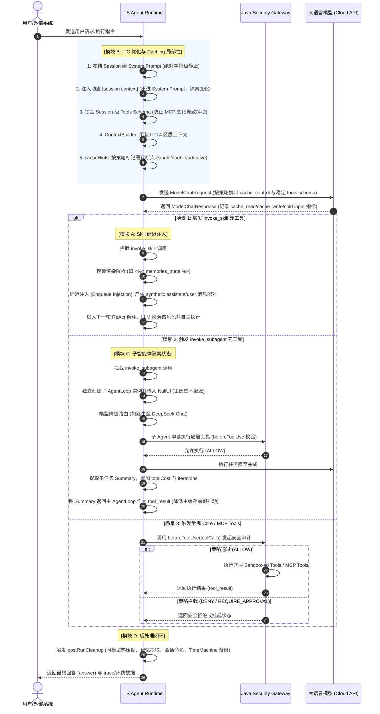

# OpenHarness 运行时核心优势对齐与优化技术方案 (Deep Alignment Plan)

> 状态：方案评审中 (Proposed)  
> 版本：v2.2 (Review 修订版：收敛绝对化表述，补充 Provider / 安全 / 成本门禁)  
> 目的：在保留 OpenHarness 企业级 Java 安全网关和并发优势的前提下，将业界在 Token 节约、自进化 Skill 生态、Subagent 路由等层面的核心优势引入并落地到 OpenHarness TS 运行时中，以可观测指标驱动 Prompt Cache 命中率向 90%+ 靠拢；是否默认启用需由 Provider Contract Tests 与 Replay Benchmark 验证。

---

## 0. Review 修订摘要与论据

本版本根据 2026-06-22 方案 Review 将原方案中的“100% 兼容”“完美规避”“彻底擦除”“90%+ 必达”等绝对化表达收敛为可验证目标，并补充以下设计门禁。

### 0.1 核心修订结论

1. **Provider 兼容性以契约测试为准**：Anthropic、Bedrock、OpenRouter 对 tool use/tool result adjacency、最后一条消息角色、parallel tool call、空 content block 等约束并不完全一致，不能仅凭 synthetic assistant/user 双消息断言 100% Strict Alternating Roles 兼容。
2. **缓存策略以成本收益为准**：Rolling Double Buffer 在长会话和高回滚率场景有价值，但会增加 cache write 机会成本；短会话、高 QPS、极低延迟链路应允许 single/off/adaptive 策略。
3. **Tools Schema 冻结不能弱化安全撤权**：会话内冻结工具定义可提升缓存稳定性，但工具执行可用性、权限撤销、管理员禁用必须动态生效；必要时通过 `tool_catalog_epoch` 强制刷新或重启会话。
4. **ITC 热压缩必须是内部操作**：压缩指令不能作为普通用户对话暴露给 ReAct 主循环；应禁止工具调用、禁止用户可见输出、使用结构化摘要 schema，并保留审计链、HITL 状态和未完成任务。
5. **Skill 自进化默认不自动写回**：LLM 生成的 Skill 优化只能先形成 patch/proposal；自动 reload 需经过权限、签名、diff 审查、灰度和回滚机制，避免固化 prompt injection 或污染全局技能。
6. **商业 Skill Shredding 是 best-effort**：零字节覆盖加 unlink 不能保证 SSD/APFS/COW/journal/swap/backup/EDR 场景不可恢复，因此安全目标应定义为降低残留风险，而非彻底物理销毁。

### 0.2 可验收指标口径

- Prompt Cache 命中率建议口径：`cache_read_input_tokens / total_input_tokens`，以 provider 原始 usage 字段为准。
- Replay Benchmark 至少输出：`cache_read_input_tokens`、`cache_write_input_tokens`、`cold_input_tokens`、TTFT、总成本、p95/p99 延迟、回滚恢复率。
- Provider Contract Tests 至少覆盖：single tool、parallel tools、multiple skills、tool failure、HITL pending、stream abort、manual interrupt、MCP restart、schema revoke。

## 1. 整体架构与职责边界

整体架构设计采用 **安全边界（Java 网关）** 与 **高效执行（TS 运行时）** 的双层结构。
在对齐核心运行时优势后，系统的完整调用时序如下：



---

## 2. 提升 Prompt Cache 命中率的七个关键决策与落地

为了在可验证边界内逼近高缓存命中率标杆，TS Runtime 应分阶段落地以下核心决策，并以 Provider Contract Tests、Replay Benchmark 与成本数据决定默认策略：

### 决策 1：滚动双缓冲 (Rolling Double Buffer) 标记与单步容错
由于大模型的缓存机制是前缀强匹配，即使历史消息是纯追加的，但在流传输中断、工具调用出错、用户强行干预（Ctrl-C）或模型改变 tool call 策略时，对话历史的尾部都会发生消息回滚或删除。如果仅标记最后一条消息为缓存，回滚将导致整个缓存标记直接作废。

* **实现细节 (`cacheHints.ts`)**：
  在每一轮请求中，根据 `cacheStrategy = off | single | double | adaptive` 选择缓存断点。`adaptive` 会结合历史 token 数、最近工具失败/回滚率、provider cache write 单价与会话预期长度决定是否启用第二个断点。对消息流中的倒数 eligible 消息（跳过 systemInjected、transient、compressionInstruction 类型的动态消息）打上 `cache_control`：
  ```typescript
  // cacheHints.ts 伪代码
  export function computeCacheHints(messages: AgentMessage[]): CacheHint[] {
    const hints: CacheHint[] = [];
    let count = 0;
    
    // 从后往前扫描，挑选 2 个符合条件的断点作为双缓冲断点
    for (let i = messages.length - 1; i >= 0 && count < 2; i--) {
      const msg = messages[i];
      if (isTransientOrSystemInjected(msg)) continue;
      
      const indexFromTail = messages.length - i;
      hints.push({
        messageIndexFromTail: indexFromTail,
        scope: msg.role === "tool" ? "tool_result_block" : "message"
      });
      count++;
    }
    return hints;
  }
  ```
* **容错原理**：当发生单步回退时，倒数第二条消息的缓存断点在云端依然是 Warm 状态，大模型能够无缝退回到倒数第二个缓存前缀继续推理，从而抗住单步抖动。

### 决策 2：绝对字符级静止的 System Prompt 与 `[session context]` 机制
System Prompt 位于请求头部的第一层（`session-stable`），任何字节的变动（如动态拼接当前时间、目录、当前模型 ID 等）都会导致后方所有的缓存全部失效。

* **改造方案 (`prompts/registry.ts`)**：
  将 System Prompt 在会话（Session）初始化时一次性渲染完成并绝对字符级冻结。
* **高频变量移出**：将当前日期时间、OS 类型、当前模型 ID、当前工作目录等全部移出 System Prompt，统一写入一个 `systemInjected: true` 且 `transient: true` 的合成 user 消息中，称为 `[session context]`：
  ```text
  [Session context: Today is 2026-06-22, Monday. Current model: claude-3-5-sonnet. Working directory: /Users/elvis/project]
  ```
* **注入顺序与时机**：注入必须在 System Prompt 初次写入空 History 之后再进行（若颠倒顺序会导致 `@history.empty?` 判定失效，从而漏掉 System Prompt）。同一天内只进行一次日期注入；当发生“切模型”、“切工作目录”时动态追加一条新 context 消息，不修改历史；当 session context 频繁变化时，应聚合或延后注入，避免尾部动态消息过度扰动。

### 决策 3：Session 级 Tools Schema 锁定机制
Tools Schema 的定义位列于 System Prompt 下方，属于缓存前缀的关键部分。OpenHarness 通过 Java 网关动态获取 Catalog 以及加载 MCP 工具，由于 MCP 服务的启停非常频繁，Tools Schema 任何微小的参数字段改动或新增工具都会导致全量 Cache 失效。

* **改造方案 (`toolRegistry.ts`)**：
  引入 **Session 级锁定表**。在会话启动并初次调用 `getFrozenCatalog()` 时，将合并后的 Tools Schema 与 sources 关系缓存到 Session 内存中。在该会话结束之前，即使外部 MCP 注册发生变化，也默认不更新 Tools Schema，以此确保会话内 tools schema 稳定；但安全撤权、破坏性 schema 变更、管理员强制禁用等事件必须通过动态执行门控或 catalog epoch 触发刷新/重启。
* **技能限制**：对于用户在中途新安装的 Skill，其定义默认不动态拼接进 Tools Schema；可通过 `[session context]` 通告，并允许大模型通过始终存在的 `invoke_skill` 元工具动态调用。安全撤权与禁用事件仍必须动态生效。

### 决策 4：用 `invoke_skill` 统一承载与子智能体状态隔离
将大任务（如文档深度分析、批量代码审查等）的中间漫长调用过程隔离在子智能体（Subagent）中执行，是控制主上下文膨胀、提升主 Agent 缓存稳定性的关键策略。

* **状态隔离机制**：
  `invoke_subagent` 或 `invoke_skill(fork_agent: true)` 触发时，后台拉起隔离的子 Agent。子 Agent 的大量工具调用、命令行执行、大文件读取仅记录在子 Agent 自己的 History 中。
* **主上下文静止**：当子 Agent 运行完毕后，将结果总结（Summary）以 `tool_result` 文本形式返回给主 Agent。对于主 Agent 而言，它的 History 中仅仅增加了一对 `invoke_subagent -> summary` 消息，上下文历史没有发生任何爆发式膨胀，因而尽量降低主上下文前缀抖动。

### 决策 5：原地同模型热压缩 (Insert-then-Compress)
放弃以前将消息导出并向 Java 外部网关（或不同模型）发起冷压缩的方案。不同模型或不同 Client 的 Caching 不能共享，冷压缩通常无法复用当前会话的 provider-side cache，容易带来 Cache Miss 与重复计费；但是否更差仍需与 ITC 做 A/B 验证。

* **ITC 压缩流**：
  1. 当上下文 Token 接近阈值（20-30 万 tokens 甜区）时，向当前会话的 `history` 尾部追加一条带有 `compressionInstruction: true` 和 `systemInjected: true` 标记的压缩指令消息（例如："请将上述历史中已做出的关键决策、已修改的文件与当前任务进度提炼成 1 万 token 以内的高浓度摘要"）。
  2. 以内部压缩模式使用当前 Session 的 LLM 实例进行一轮推理，尽量复用已 Warm 的缓存前缀；实际 cache read/write 与尾部 cold token 成本必须以 provider usage 字段记录。
  3. 获取并校验结构化摘要输出后，按分层策略替换可压缩旧历史；审计链、HITL 状态、未完成任务、tool call id 映射等不可直接丢弃。从第二轮起，由 cache marker 策略重新接管新的简短历史并建立 Warm 缓存。
  4. 空闲 5 分钟定时器（`IdleSessionTimer`）在后台执行上述压缩，并利用 `max_tokens: 1` 发起 Probe 探测，使用 Mutex 锁防止与用户新输入冲突，目标是在用户返回前完成压缩与预热；该动作必须可关闭，并受 provider 限流、成本阈值和互斥锁保护。

### 决策 6：自进化脚本沙箱化，拒绝 Tools Schema 膨胀
文档解析（如 PDF 提取、Excel 表分析、Word 处理等）是非常高频的 Agent 场景。如果为每种文档格式注册 `read_pdf`、`read_excel` 等专属工具，会导致 Tools Schema 异常庞大，且依赖底层的 C++ 等繁重库，极易抖动失效。

* **脚本自进化机制**：
  在 `~/.openharness/scripts/` 中内置文档处理的轻量化 Python 脚本（利用 openpyxl、pdfplumber、python-docx 等成熟生态）。
* **通用命令行执行**：大模型需要读取 PDF/Excel 时，不调用专属工具，而是使用通用的 `terminal` 工具运行 Python 脚本进行处理。
* **脚本自愈**：如果执行失败（例如因库版本不一致导致报错），大模型有能力直接使用 `edit` 修改该 Python 解析脚本或执行 pip 安装，在人工审批或受限策略下实现“解析技能自愈自进化”，而 Tools Schema 完全不需要有任何变更。

---

## 3. 模块细化设计与 TypeScript 类型

### 模块 A：自进化 Skill 执行引擎

#### 1. 类型定义 (`agent-runtime/src/skills/types.ts`)
```typescript
export interface SkillMetadata {
  name: string;
  description: string;
  version: string;
  tools_required: string[];
  parameters: Record<string, any>;
  tags?: string[];
  category?: string;
  author?: string;
  fork_agent?: boolean;
  subagent_model?: string;
  forbidden_tools?: string[];
  encrypted?: boolean;
  brand_id?: string;
  license_key?: string;
}

export interface Skill {
  metadata: SkillMetadata;
  content: string; // Markdown 步骤主体
  sourcePath: string;
}

export interface PendingInjection {
  skillName: string;
  expandedContent: string;
  task: string;
}
```

#### 2. SKILL.md 解析算法 (`agent-runtime/src/skills/loader.ts`)
```typescript
import * as yaml from "js-yaml";
import * as fs from "node:fs";

export function parseSkillMarkdown(filePath: string): Skill {
  const fileContent = fs.readFileSync(filePath, "utf-8");
  if (!fileContent.startsWith("---")) {
    throw new Error(`Invalid skill format: ${filePath} (Missing YAML Frontmatter)`);
  }

  // 兼容标准 YAML+Markdown 提取正则
  const match = fileContent.match(/^---\r?\n([\s\S]*?)\r?\n---\r?\n([\s\S]*)/);
  if (!match) {
    throw new Error(`Parse error: Frontmatter delimiters mismatch in ${filePath}`);
  }

  const metadata = yaml.load(match[1]) as SkillMetadata;
  const content = match[2].trim();

  return {
    metadata,
    content,
    sourcePath: filePath
  };
}
```

#### 3. Provider Adapter 能力门禁

延迟注入不直接假设所有 provider 都接受 synthetic assistant/user 双消息。Provider adapter 需声明以下能力位，并在请求构造阶段选择注入形态：

```typescript
export interface ProviderMessageCapabilities {
  supportsSyntheticAssistantInjection: boolean;
  requiresLastUserMessage: boolean;
  requiresToolResultAdjacency: boolean;
  supportsParallelToolResults: boolean;
}
```

默认策略：优先使用 `user` role 的 system-tagged instruction envelope；仅当 provider contract tests 证明安全时，才启用 synthetic assistant + user 双消息。

#### 3. 延迟注入的消息时序
在 `agentLoop.ts` 拦截 `invoke_skill`：

```typescript
// agentLoop.ts 伪代码
if (toolCall.name === "invoke_skill") {
  const args = JSON.parse(toolCall.argumentsRaw);
  const skill = this.skillLoader.getSkill(args.skill_name);
  
  if (skill.metadata.fork_agent) {
    // 路由至子智能体
    const result = await SubagentDispatcher.execute(this.context, args.task, {
      model: skill.metadata.subagent_model,
      forbiddenTools: skill.metadata.forbidden_tools
    });
    return { role: "tool", toolCallId: toolCall.id, content: JSON.stringify(result) };
  } else {
    // 延迟注入路径：暂存并在 observe 之后 flush 进历史消息中
    const expandedContent = this.templateEngine.render(skill.content, this.getTemplateContext());
    this.enqueueInjection({
      skillName: skill.metadata.name,
      expandedContent,
      task: args.task
    });
    // 必须在此处正常返回 tool_result，否则会阻断 Alternating Roles
    return { role: "tool", toolCallId: toolCall.id, content: `Skill ${args.skill_name} instructions expanded. Please proceed.` };
  }
}
```

在工具执行结束后，调用 `flushPendingInjections()` 注入：
* 消息 1：`{ role: "assistant", content: "[SYSTEM] Skill loaded:\n" + expandedContent, systemInjected: true }`
* 消息 2：`{ role: "user", content: "[SYSTEM] The skill instructions above have been loaded. Please proceed to execute the task now.", systemInjected: true }`
* 之后触发下一轮大模型推理。

---

## 3.5 分阶段 OpenSpec 落地边界

该方案涉及新增能力、运行时语义、安全策略、性能策略和用户可见行为变化，实施前必须拆分为 OpenSpec change 并获批，避免一次性大爆炸式改造。建议拆分如下：

1. `add-runtime-cache-stability`：System Prompt 静止、`[session context]`、cache hints、Tools Schema freeze 与动态门控。
2. `add-skill-invocation-sandbox`：Skill loader、`invoke_skill`、延迟注入、加密 Skill best-effort shredding、权限与审计。
3. `add-subagent-dispatcher`：隔离子 Agent、模型路由、取消/超时、费用汇总、审计链。
4. `add-internal-context-compression`：ITC 内部压缩协议、idle timer、结构化摘要校验、预热策略。

每个 change 均需补齐 spec delta、tasks、必要 design，并通过 `openspec validate <change-id> --strict --no-interactive`。

## 4. 物理文件修改与新增清单

对齐工作将主要对 TS Runtime 进行改造，核心涉及的文件及新增项如下：

| 文件路径 | 变更类型 | 预估行数 | 核心改造点描述 |
| :--- | :---: | :---: | :--- |
| `agent-runtime/src/skills/types.ts` | 新增 | 50 | 定义 Skill、SkillMetadata 以及 PendingInjection 等接口定义。 |
| `agent-runtime/src/skills/loader.ts` | 新增 | 150 | 实现 SkillLoader 负责四级路径扫描、YAML 前置元数据解析、解密及热重载。 |
| `agent-runtime/src/skills/evolution.ts` | 新增 | 100 | 实现自进化判定条件与反思 Prompt，生成改进 SKILL.md。 |
| `agent-runtime/src/subagent/dispatcher.ts` | 新增 | 120 | 实现 SubagentDispatcher，处理隔离子 Agent 初始化、廉价模型路由与费用汇总。 |
| `agent-runtime/src/contextBuilder.ts` | 修改 | 180 | 重构 buildModelContext，实现 ITC 4 区分层与缓存标记注入，支持 `[session context]`。 |
| `agent-runtime/src/cacheHints.ts` | 修改 | 60 | 重写为策略化缓存断点算法，支持 off/single/double/adaptive，并按 provider 成本与回滚率选择 eligible 消息打缓存标记。 |
| `agent-runtime/src/compression.ts` | 修改 | 200 | 重构为 Insert-then-Compress (ITC) 原地热压缩，引入渐进式 4 级压缩。 |
| `agent-runtime/src/idleCompressionTimer.ts` | 新增 | 110 | 实现空闲定时器、排他锁控制、以及 max_tokens: 1 的预热 Dummy 调用。 |
| `agent-runtime/src/agentLoop.ts` | 修改 | 250 | 挂载 `invoke_skill` 拦截与延迟注入、子智能体执行集成、以及 postRunCleanup 后处理闭环。 |

---

## 5. 测试与验证策略 (Test Harness & Verification)

对齐改造的质量通过 15 个测试文件形成的安全网进行拦截与评估。

### 1. 新增测试文件
* `agent-runtime/test/skills.test.ts`：
  - 测试 YAML 解析器，验证字段缺失报错。
  - 测试四级加载优先级与同名覆盖。
  - 测试延迟注入（验证 synthetic assistant 和 user 消息的顺序）。
  - 测试商业加密技能的解密与文件粉碎（Shred）。
* `agent-runtime/test/compression_caching.test.ts`：
  - 模拟大消息量输入，测试渐进式压缩的 4 个等级，验证 token 计数。
  - 测试空闲预热，验证 dummy probe 探测请求是否发出。
  - 测试 single/double/adaptive Cache Marker 是否在消息数组的静态与低频区分界处正确注入，并统计 cache write 成本。
* `agent-runtime/test/subagent.test.ts`：
  - 验证子智能体被拉起后的上下文隔离情况。
  - 测试费用、iteration 计数正确回传给主 Agent 累加。
  - 验证递归调用限制（IS_SUBAGENT=true 抛出 Error）。

### 1.5 Provider / 安全 / 故障注入测试补充

* Provider Contract Tests：覆盖 Anthropic direct、Bedrock、OpenRouter 的 message role、tool use/tool result adjacency、parallel tool call、stream abort 与 synthetic injection 兼容性。
* Fault Injection Tests：覆盖工具失败、HITL pending/timeout、用户中断、MCP restart、schema revoke、idle compression 与用户输入竞争。
* Security Tests：覆盖 Skill path traversal、frontmatter injection、encrypted skill tamper、自进化恶意 patch、subagent forbidden tool bypass。

### 2. 回归与 Benchmark 测试
* 运行现有测试，确保不破坏既有行为：
  ```bash
  pnpm --filter @openharness/agent-runtime test
  ```
* 运行 Replay Benchmark：
  - 执行 `pnpm eval:replay`，回放长会话场景下的事件。对比对齐前后**首字响应时间 (TTFT)** 与 **全局 Token 消耗量**。预期指标：
    * 连续交互场景下，大模型 Prompt 缓存命中率从 <20% 向 90%+ 靠拢；正式达标口径建议定义为 `cache_read_input_tokens / total_input_tokens >= 0.90`。
    * 后续会话首字响应时间降低 50% 以上。
    * 长会话 Token 计费相比旧版简单截断与无缓存模式节约 40% 的成本。

---

## 6. 实施里程碑 (Implementation Milestones)

| 里程碑 | 目标与交付物 | 核心验收标准 |
| :---: | :--- | :--- |
| **M1: Skill 底座与沙箱注入** | 1. 落地 `SkillLoader` 加载机制。<br>2. 落地 `agentLoop.ts` 中的延迟注入机制。 | 1. 扫描能成功加载 built-in 及 local skills。<br>2. `invoke_skill` 注入形态由 provider adapter 能力位决定，并通过 contract tests。<br>3. 加密脚本 best-effort shredding、权限审计与残留风险说明验证通过。 |
| **M2: ITC 缓存与渐进式压缩** | 1. 重构 `contextBuilder.ts` 和 `cacheHints.ts`。<br>2. 实现 `compression.ts` 的渐进式压缩与后台预热。 | 1. Caching 标记按策略落点，单元测试校验 single/double/adaptive 断点。<br>2. 空闲触发压缩后，预热 Probe 受成本、限流和互斥锁保护。<br>3. 压缩作为 internal operation 执行，不产生用户可见普通回复，不丢失审计链/HITL 状态。 |
| **M3: 子智能体分发与闭环演进** | 1. 落地 `SubagentDispatcher`。<br>2. 落地 `postRunCleanup` 会话闭环（自反射进化、记忆提取、会话命名）。 | 1. 子 Agent 能够独立使用 DeepSeek 运行，并自动折折算汇总总成本。<br>2. 任务结束后成功写入新的 `MemoryFact` 并在下一轮正确注入。 |
