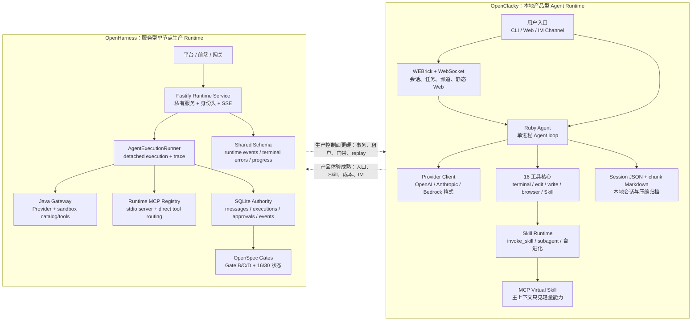
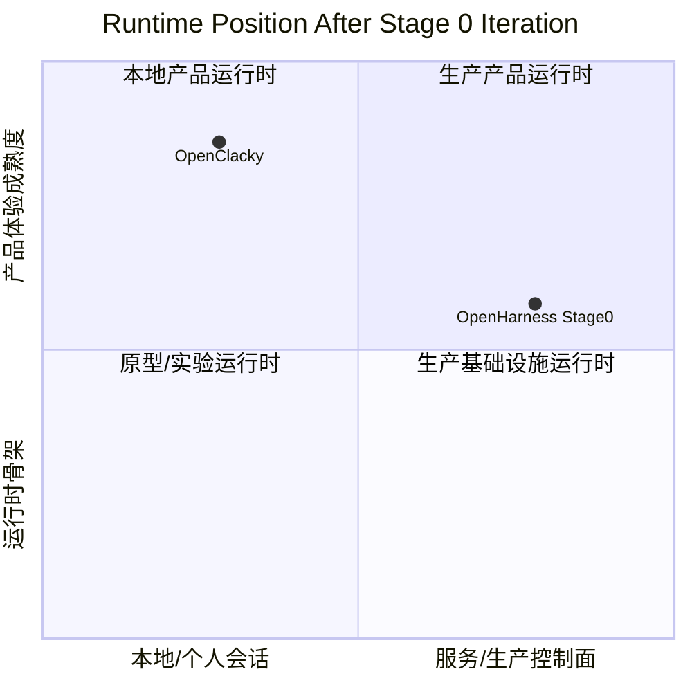
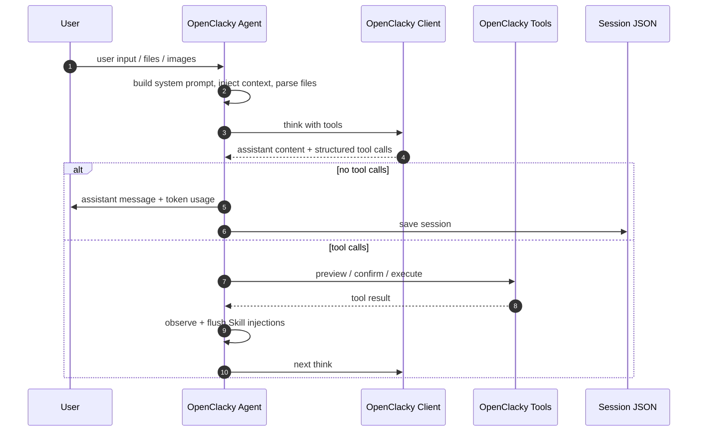
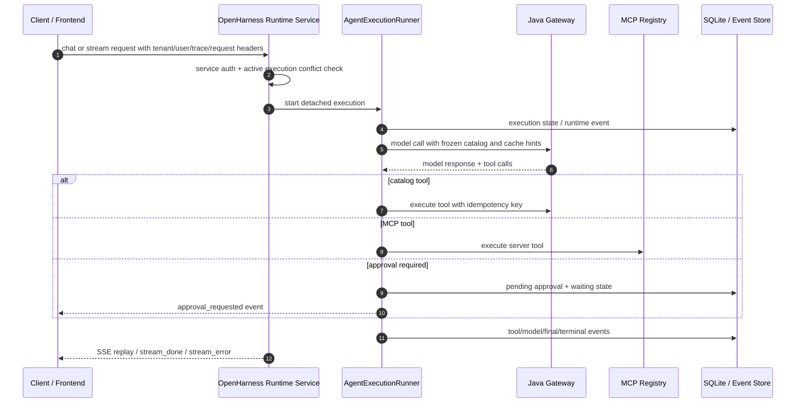
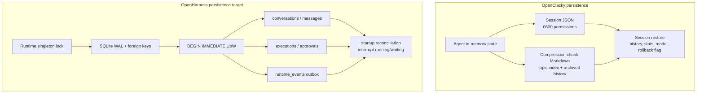
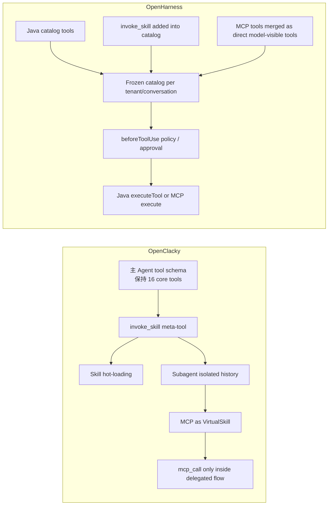
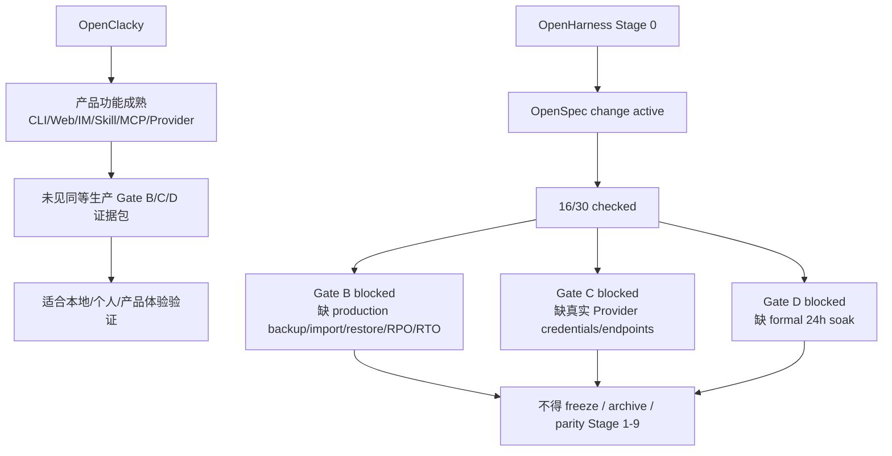

# OpenClacky / OpenHarness Runtime Comparison Review

## 结论

有风险。

经过 Stage 0 runtime production closeout 这一轮迭代后，两个运行时已经不是同一类目标：

1. **OpenClacky** 是成熟度更高的本地产品型 Agent Runtime：CLI / Web / IM channel 更完整，Provider 兼容、Skill / MCP token 隔离、成本与缓存工程、会话续跑体验更强；但核心持久化仍偏本地个人会话模型，不具备已审计的生产 cutover、事务型生命周期权威、RPO/RTO 与 24 小时 soak 门禁。
2. **OpenHarness Agent Runtime** 是生产控制面更强的服务型 Runtime：私有服务、租户/用户/会话作用域、SQLite 单节点持久化权威、执行/审批/事件 schema、SSE replay、Java sandbox / MCP / Provider 网关分层、OpenSpec 证据门禁已经成型；但本轮只达到 **16/30**，Gate B / Gate C / Gate D 仍 blocked，不能宣称 production-ready。
3. 若要做 OpenClacky parity，当前不能直接推进 Stage 1-9。应先关闭 OpenHarness Stage 0 生产证据缺口，之后再以新的 OpenSpec change 定义“产品体验 parity”范围，避免把 OpenClacky 的产品能力混进当前生产 closeout 门禁。

一句话：**OpenClacky 更像“可用、好用、集成面丰富的本地 Agent 产品运行时”；OpenHarness 更像“正在收口的单节点生产 Agent 服务运行时骨架”。这一轮之后，OpenHarness 的可靠性设计明显更硬，但还没有拿到真实生产证据闭环。**

## 文档类型 / 日志及版本

- 文档类型：Architecture / Runtime Comparison Review
- 日期：2026-07-09
- OpenClacky 工作区：[OpenClacky repository](file:///Users/elvis/file/develop/opensource/openclacky)
- OpenHarness 工作区：[OpenHarness Stage 0 worktree](file:///Users/elvis/file/develop/opensource/openharness/.worktrees/add-openclacky-runtime-parity-roadmap)
- OpenClacky 分支：`main`
- OpenHarness 分支：`stage0-runtime-production-closeout`
- 本轮性质：只读对比 + review 落盘；未修改 OpenSpec tasks、未启动 Gate B/C/D、未提交/合并/归档。

## Review 范围

### OpenClacky

- [OpenClacky root](file:///Users/elvis/file/develop/opensource/openclacky)
- [README](file:///Users/elvis/file/develop/opensource/openclacky/README.md)
- [openclacky.gemspec](file:///Users/elvis/file/develop/opensource/openclacky/openclacky.gemspec)
- [OpenClacky Agent](file:///Users/elvis/file/develop/opensource/openclacky/lib/clacky/agent.rb)
- [OpenClacky Client](file:///Users/elvis/file/develop/opensource/openclacky/lib/clacky/client.rb)
- [OpenClacky LLM Caller](file:///Users/elvis/file/develop/opensource/openclacky/lib/clacky/agent/llm_caller.rb)
- [OpenClacky Tool Executor](file:///Users/elvis/file/develop/opensource/openclacky/lib/clacky/agent/tool_executor.rb)
- [OpenClacky Tool Registry](file:///Users/elvis/file/develop/opensource/openclacky/lib/clacky/agent/tool_registry.rb)
- [OpenClacky Terminal Security](file:///Users/elvis/file/develop/opensource/openclacky/lib/clacky/tools/security.rb)
- [OpenClacky Terminal Tool](file:///Users/elvis/file/develop/opensource/openclacky/lib/clacky/tools/terminal.rb)
- [OpenClacky Session Manager](file:///Users/elvis/file/develop/opensource/openclacky/lib/clacky/session_manager.rb)
- [OpenClacky Session Serializer](file:///Users/elvis/file/develop/opensource/openclacky/lib/clacky/agent/session_serializer.rb)
- [OpenClacky Message Compressor](file:///Users/elvis/file/develop/opensource/openclacky/lib/clacky/agent/message_compressor.rb)
- [OpenClacky MCP Registry](file:///Users/elvis/file/develop/opensource/openclacky/lib/clacky/mcp/registry.rb)
- [OpenClacky HTTP Server](file:///Users/elvis/file/develop/opensource/openclacky/lib/clacky/server/http_server.rb)
- [OpenClacky Channel Runtime](file:///Users/elvis/file/develop/opensource/openclacky/lib/clacky/server/channel.rb)
- [OpenClacky MCP Architecture](file:///Users/elvis/file/develop/opensource/openclacky/docs/mcp-architecture.md)
- [OpenClacky Channel Architecture](file:///Users/elvis/file/develop/opensource/openclacky/docs/channel-architecture.md)
- [OpenClacky UI Architecture](file:///Users/elvis/file/develop/opensource/openclacky/docs/ui2-architecture.md)

### OpenHarness

- [OpenHarness Stage 0 worktree](file:///Users/elvis/file/develop/opensource/openharness/.worktrees/add-openclacky-runtime-parity-roadmap)
- [OpenHarness active tasks](file:///Users/elvis/file/develop/opensource/openharness/.worktrees/add-openclacky-runtime-parity-roadmap/openspec/changes/harden-agent-runtime-single-node-production/tasks.md)
- [OpenHarness proposal](file:///Users/elvis/file/develop/opensource/openharness/.worktrees/add-openclacky-runtime-parity-roadmap/openspec/changes/harden-agent-runtime-single-node-production/proposal.md)
- [OpenHarness design](file:///Users/elvis/file/develop/opensource/openharness/.worktrees/add-openclacky-runtime-parity-roadmap/openspec/changes/harden-agent-runtime-single-node-production/design.md)
- [OpenHarness production runbook](file:///Users/elvis/file/develop/opensource/openharness/.worktrees/add-openclacky-runtime-parity-roadmap/docs/architecture/agent-runtime-v1-production-runbook.md)
- [OpenHarness Gate Status Reverification](file:///Users/elvis/file/develop/opensource/openharness/.worktrees/add-openclacky-runtime-parity-roadmap/docs/review/2026-07-09-stage0-gate-status-reverification-review.md)
- [OpenHarness Gate B Blocked Review](file:///Users/elvis/file/develop/opensource/openharness/.worktrees/add-openclacky-runtime-parity-roadmap/docs/review/2026-07-09-stage0-gate-b-production-evidence-blocked-review.md)
- [OpenHarness server](file:///Users/elvis/file/develop/opensource/openharness/.worktrees/add-openclacky-runtime-parity-roadmap/agent-runtime/src/server.ts)
- [OpenHarness execution runner](file:///Users/elvis/file/develop/opensource/openharness/.worktrees/add-openclacky-runtime-parity-roadmap/agent-runtime/src/agentExecutionRunner.ts)
- [OpenHarness tool registry](file:///Users/elvis/file/develop/opensource/openharness/.worktrees/add-openclacky-runtime-parity-roadmap/agent-runtime/src/toolRegistry.ts)
- [OpenHarness MCP registry](file:///Users/elvis/file/develop/opensource/openharness/.worktrees/add-openclacky-runtime-parity-roadmap/agent-runtime/src/mcpRegistry.ts)
- [OpenHarness runtime storage](file:///Users/elvis/file/develop/opensource/openharness/.worktrees/add-openclacky-runtime-parity-roadmap/agent-runtime/src/storage/runtimeStorage.ts)
- [OpenHarness lifecycle commands](file:///Users/elvis/file/develop/opensource/openharness/.worktrees/add-openclacky-runtime-parity-roadmap/agent-runtime/src/storage/lifecycleCommands.ts)
- [OpenHarness shared schema](file:///Users/elvis/file/develop/opensource/openharness/.worktrees/add-openclacky-runtime-parity-roadmap/packages/shared-schema/src/index.ts)
- [OpenHarness Stage 1 Gate B Evidence](file:///Users/elvis/file/develop/opensource/openharness/.worktrees/add-openclacky-runtime-parity-roadmap/docs/verification/agent-runtime-v1/stage1-gate-b.md)
- [OpenHarness Formal Soak Preflight Harness](file:///Users/elvis/file/develop/opensource/openharness/.worktrees/add-openclacky-runtime-parity-roadmap/docs/verification/agent-runtime-v1/task13-formal-soak-preflight-harness.md)

## 总览图

## 主要发现

### 1. 运行时定位图

| 维度 | OpenClacky | OpenHarness after Stage 0 |
|---|---|---|
| 当前主定位 | 本地 Agent 产品运行时 | 私有服务型 Agent Runtime |
| 用户入口 | CLI、Web、IM channel 都已产品化 | 平台/前端通过服务 API 与 SSE 接入 |
| Agent 主体 | Ruby 单进程内 Agent loop | TypeScript Fastify service + detached runner |
| 生产证据 | 未见同等 Gate B/C/D 证据体系 | 有 Gate 体系，但当前 16/30，Gate B/C/D blocked |
| 最强项 | 使用体验、Skill/MCP token 经济、Provider 兼容、会话成本工程 | 事务边界、租户隔离、生命周期事件、审批持久化、OpenSpec 门禁 |
| 主要缺口 | 生产 cutover/RPO/RTO/soak/多租户事务权威 | 真实生产证据、真实 Provider Gate C、24 小时 Gate D、产品入口丰富度 |

### 2. 执行循环对比图

关键差异：

| 执行语义 | OpenClacky | OpenHarness after Stage 0 |
|---|---|---|
| 主循环位置 | Agent 实例内同步 loop；每轮 `think → act → observe` | Runner 与 HTTP 连接解耦，执行状态可被查询与 replay |
| Tool call 完成条件 | 没有 tool calls 才结束；额外处理 fake tool call 与上游截断 | `stream_done` 前先终止 execution state，schema 定义 terminal error |
| 审批模型 | UI 确认、preview、deny feedback；偏交互式本地用户 | `approval_requested`、pending approval、execution waiting、reply API、timeout |
| 事件模型 | UI events + session replay | runtime event schema、trace event、SSE replay、terminal event |
| 并发边界 | 面向单用户/多 session 产品体验 | tenant/user/conversation active conflict 与一会话一 active execution |

### 3. 持久化与恢复对比图

| 持久化维度 | OpenClacky | OpenHarness after Stage 0 |
|---|---|---|
| 持久化权威 | 本地 session JSON；压缩历史进入 Markdown chunk | 设计目标为 SQLite 唯一 authority；schema 已覆盖 history/execution/approval/event/memory |
| 写入原子性 | 文件写入 + best-effort cleanup；适合本地会话 | `BEGIN IMMEDIATE`、WAL、foreign key、busy retry、singleton lock |
| 运行中恢复 | restore session、deferred rollback、Time Machine | running / waiting approval 启动后转 `EXECUTION_INTERRUPTED`，pending approval invalidated |
| 旧数据 cutover | 未见 production backup/import/quarantine Gate | active change 要求 production backup/import/quarantine/restore 与 RPO/RTO；当前缺证据 |
| 多租户隔离 | 以本地 session 为核心 | schema 和 API 均带 tenant/user/conversation scope |
| 生产状态 | 产品可用但非审计型生产迁移体系 | 设计/本地实现强，但 Gate B 仍 `pending_production_evidence` |

### 4. Provider / Model 调用对比

| 维度 | OpenClacky | OpenHarness after Stage 0 |
|---|---|---|
| Provider 位置 | Ruby Client 直接调用 Provider / compatible API | TypeScript Runtime 通过 Java Gateway 发起 model/tool 请求 |
| 格式适配 | OpenAI chat、Anthropic messages、Bedrock Converse 自动分支 | Runtime 传标准请求给 Java Gateway，由 Java 侧承担 Provider adapter |
| 缓存策略 | Claude prompt caching、cache marker、Insert-then-Compress、idle compression | compute cache hints，Runtime 自动压缩，但产品化成本工程弱于 OpenClacky |
| 延迟指标 | Client 记录 duration、TTFT alias、output TPS | Runtime trace/progress/schema 可观测，Provider 真实矩阵仍 Gate C pending |
| 失败处理 | retry/fallback/probing、context overflow compression、fake tool call/truncation 防御 | terminal error schema、RuntimeTerminalFailure、step budget、execution timeout |
| 当前证据 | 产品代码与文档成熟 | fake Provider local_verified；真实 OpenAI-compatible / Anthropic credentials 未验收 |

判断：OpenClacky 的 Provider 兼容是产品层更成熟；OpenHarness 的 Provider 调用被架构性隔离到 Java Gateway，更利于企业服务治理，但 Stage 0 还没有通过真实 Provider Gate C。

### 5. Tool / MCP / Skill 对比图

| 维度 | OpenClacky | OpenHarness after Stage 0 |
|---|---|---|
| Tool schema 哲学 | 极小核心工具，能力通过 Skill 和 subagent 扩展 | Frozen catalog，把 Java catalog、Skill、MCP 合并给模型 |
| MCP 暴露方式 | MCP server 作为 VirtualSkill；主上下文不注入完整 schema | MCP tools 进入 Runtime catalog，冲突时 drop MCP version |
| MCP 生命周期 | lazy start，5 分钟 idle reaper | Runtime init 启动 stdio server；Fastify close 时 shutdown |
| Skill 执行 | `invoke_skill` 是核心产品能力，支持自进化和子 Agent 隔离 | `invoke_skill` 已进入 catalog，可 fork subagent 或 inline injection |
| 安全/审批 | permission mode、UI confirm、terminal safety、write/edit preview | beforeToolUse、tool permission、untrusted output tracking、approvalStore |
| 适用方向 | token 经济和产品扩展性更强 | 可审计工具治理和服务边界更强 |

最关键差异：OpenClacky 刻意避免让主模型看到大量 MCP schema，追求上下文和成本稳定；OpenHarness 更偏平台网关一致性，允许 MCP 作为 catalog 工具直接参与 policy/approval/trace。

### 6. UI / Channel / 产品入口对比

| 维度 | OpenClacky | OpenHarness after Stage 0 |
|---|---|---|
| CLI | 核心入口，Rich UI/JSON UI 都存在 | 非核心目标 |
| Web UI | 内置 Web server + WebSocket + session replay | 前端通过 Runtime API/SSE 消费事件 |
| IM Channel | Channel adapter 架构，复用 SessionRegistry，支持多平台方向 | 当前 Stage 0 不覆盖 IM channel parity |
| Agent / UI 边界 | Agent 通过 UIInterface `show_*`，ChannelUIController 适配 | Runtime 通过 schema/SSE/progress panel/trace panel 输出 |
| 产品成熟度 | 明显更完整 | 主要是平台控制面与观测面 |

### 7. 安全边界对比

| 安全维度 | OpenClacky | OpenHarness after Stage 0 |
|---|---|---|
| 服务访问 | 本地默认；公共绑定时 access key | 私有服务，`AGENT_RUNTIME_REQUIRE_SERVICE_AUTH` + bearer token |
| 身份作用域 | session / channel 用户信息为主 | 必需 `X-Tenant-Id`、`X-User-Id`、`X-Trace-Id`、`X-Request-Id` |
| Tool 安全 | shell 安全层、`curl | bash` rewrite、sudo/kill/server 管理阻断、write/edit preview | beforeToolUse、permission、approval token、catalog hash/version、idempotency key |
| Secret 处理 | session serializer 排除 API key；本地文件权限 0600 | raw approval token 设计为 memory-only，SQLite 存 HMAC digest；真实 redaction Gate C 未完成 |
| IDOR / tenant | 非核心生产多租户模型 | active change 明确 tenant/user/conversation scope；已有本地测试/证据 |

判断：OpenClacky 对个人主机误操作防护更细；OpenHarness 对服务型身份、租户、审批和审计边界更系统，但真实生产 credential/redaction 仍不能算通过。

### 8. 门禁成熟度对比

| 门禁项 | OpenClacky | OpenHarness after Stage 0 |
|---|---|---|
| OpenSpec task 状态 | 未采用同一门禁体系 | active change 仍 open，16/30 |
| Gate B | 未见 production cutover evidence packet | blocked；2.6 / 2.7 不得勾选 |
| Gate C | Provider 兼容代码成熟，但非 OpenHarness strict evidence | blocked；fake Provider local_verified 不能替代真实 credentials |
| Gate D | 未见固定 24 小时 Runtime soak gate | blocked；local short baseline 与 preflight 不等于 formal soak |
| Archive/freeze | 不适用 | 禁止推进 |
| Parity Stage 1-9 | OpenClacky 是参照物 | 当前禁止推进，需等 Stage 0 production closeout 后另起 change |

## 能力差异矩阵

评分只表达本轮代码/文档审查下的相对成熟度，不代表线上 SLA。

| 能力 | OpenClacky | OpenHarness after Stage 0 | 结论 |
|---|---:|---:|---|
| 本地交互体验 | 5/5 | 2/5 | OpenClacky 胜出明显 |
| Web / Channel 产品入口 | 4/5 | 2/5 | OpenClacky 已产品化；OpenHarness 是平台 API/SSE |
| Provider 兼容产品性 | 4/5 | 3/5 | OpenClacky 直接成熟；OpenHarness 架构隔离但 Gate C 未过 |
| Tool/MCP token 经济 | 5/5 | 3/5 | OpenClacky 的 VirtualSkill 设计更省上下文 |
| Skill / subagent 产品能力 | 5/5 | 3/5 | OpenHarness 已有核心形态，但生态和自进化不如 OpenClacky |
| 持久化事务边界 | 2/5 | 4/5 | OpenHarness 设计与本地实现更强 |
| 多租户/服务身份 | 1/5 | 4/5 | OpenHarness 明显更适合平台私有服务 |
| Runtime event / replay / progress schema | 2/5 | 4/5 | OpenHarness 更系统 |
| 审批持久化 / recovery | 2/5 | 4/5 | OpenHarness 的 waiting/invalidated/interrupted 语义更硬 |
| 生产证据闭环 | 1/5 | 2/5 | OpenHarness 有门禁但未完成；OpenClacky 未见同等证据体系 |
| 当前可对外宣称 production-ready | 否 | 否 | 两者都不能按 OpenHarness strict production gate 宣称 |

## 关键判断

### OpenClacky 更强的部分

1. **产品入口完整**：CLI、Web、IM channel、session replay、Rich UI / JSON UI 都比 OpenHarness 当前 Stage 0 更接近最终用户产品。
2. **Token / 成本工程更成熟**：冻结 system prompt、prompt cache marker、Insert-then-Compress、idle compression、Skill/subagent 隔离，都是围绕长会话成本做的产品级优化。
3. **Skill / MCP 设计更极致**：MCP 作为 VirtualSkill 暴露，主 Agent 不吞大量 schema；这对长上下文、缓存命中和工具列表稳定性更有利。
4. **Provider 兼容面更直接**：Ruby Client 内直接处理 OpenAI / Anthropic / Bedrock 格式、streaming callback、latency 与 prompt caching。
5. **本地安全细节更多**：terminal 安全层、write/edit preview、shell command rewrite、session 文件权限都围绕个人开发环境打磨。

### OpenHarness 更强的部分

1. **服务型边界明确**：Runtime 是私有服务，前端/平台通过身份头和 bearer token 进入，不把用户身份混进 body/query。
2. **生命周期状态更强**：execution、approval、runtime event、terminal error 进入 schema 和 store；可做 replay、trace、progress panel。
3. **SQLite 单节点生产方向更硬**：WAL、foreign key、`BEGIN IMMEDIATE`、singleton lock、partial unique index、outbox/dead-letter 设计，比本地 JSON session 更接近生产事务系统。
4. **恢复语义更审计友好**：running / waiting approval 启动后显式中断，pending approval invalidated，不重放 model/tool side effects。
5. **OpenSpec 门禁更严格**：明确区分 `local_verified` 与 `production_verified`，防止 local fixture 被误当生产结论。

### OpenHarness 仍不能越过的部分

1. **Gate B**：缺真实 production backup/import/quarantine/restore、pre-cutover restore/abort、post-cutover forward-fix、measured RPO/RTO。
2. **Gate C**：缺真实 OpenAI-compatible / Anthropic credentials 和 endpoint evidence。
3. **Gate D**：缺 24 小时、30 秒采样、固定 60/20/15/5 workload、指定 TS Runtime restarts 的 formal soak。
4. **Closeout**：5.x 未完成，不能 freeze、dashboard verified、archive。
5. **Parity**：OpenClacky parity Stage 1-9 仍应禁止推进，除非先完成当前 active production closeout 或新建并批准独立 OpenSpec change。

## 推荐路线

### 短期：不要做 parity，先关 Stage 0 生产证据

1. 准备 Gate B evidence packet：production backup manifest、import report、quarantine decision、restore rehearsal output、abort output、forward-fix marker、measured RPO/RTO。
2. Gate B 通过后再请求 Gate C：真实 Provider credential matrix，且必须包含 redaction / usage / cost / retry / timeout / cancel 证据。
3. Gate C 通过后再进入 Gate D：formal 24h soak，不使用 compressed/local simulation 代替。

### 中期：Stage 0 完成后，单独开 OpenClacky parity change

建议拆成独立 OpenSpec，而不是塞进当前 closeout：

| Parity 方向 | 推荐优先级 | 理由 |
|---|---:|---|
| Skill / MCP token isolation | 高 | OpenClacky 的 VirtualSkill 机制对成本和上下文稳定性价值大 |
| CLI / local developer UX | 中 | OpenHarness 当前更偏平台服务，可作为后续产品层 |
| IM Channel adapters | 中 | 属于用户入口/集成面，不应污染 Runtime production gate |
| Idle compression / cache marker parity | 高 | 可直接改善长会话成本，但需要 Provider adapter 证据 |
| Session export/import UX | 中 | OpenHarness 已有 import/cutover 门禁，应先完成生产证据 |

## 后续门禁

- OpenSpec proposal：本 review 不新增行为，不需要新 proposal。若要实现 OpenClacky parity，必须另建 OpenSpec change 并获批。
- Superpowers plan：本 review 不生成 [OpenHarness Superpowers plans directory](file:///Users/elvis/file/develop/opensource/openharness/.worktrees/add-openclacky-runtime-parity-roadmap/docs/superpowers/plans/) 下可执行计划；当前 active change 已有计划且仍受 Gate B/C/D 约束。
- TDD / implementation：本轮未改代码，未改 tasks。
- Verification：只读代码/文档抽查；后续若使用本对比推进实现，需要按 TDD 与 verification gate 重新执行。
- 人工审批：Gate B evidence acceptance、Gate C credential use、Gate D start/promotion 仍需要独立人工审批。
- 是否修改项目规则：否。
- 是否仍需 OpenSpec / 后续实施计划：是。Stage 0 生产 closeout 仍 open；OpenClacky parity 只能作为后续独立 change。
